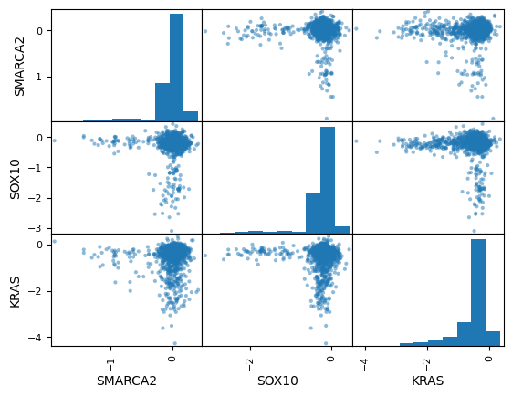
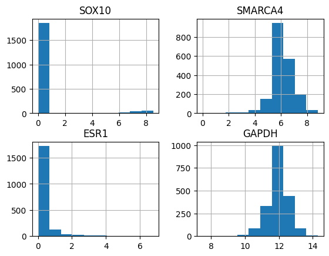
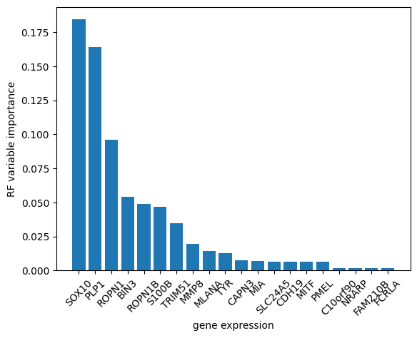
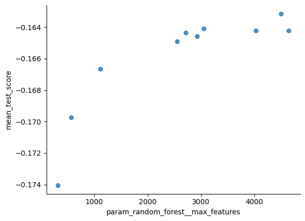
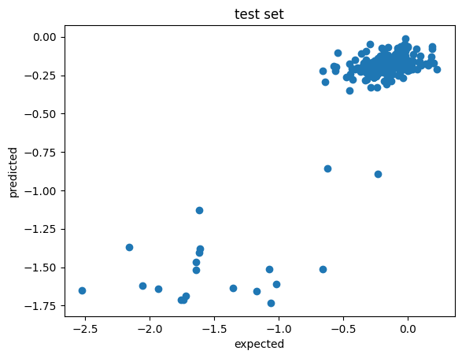
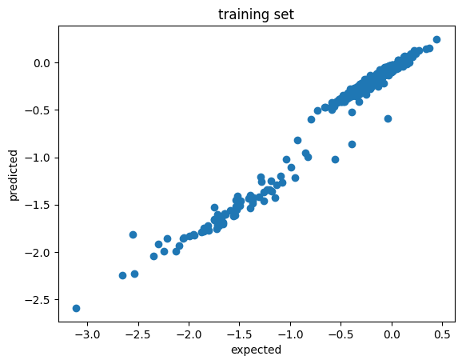

```python
import pandas as pd
import matplotlib.pyplot as plt
import numpy as np
```


```python
import os
os.getcwd()
```


    '/content'


```python
os.chdir("/content/drive/MyDrive/Colab Notebooks/ML_practice")
```

Look at overall distribution of the data


```python
sample_data = pd.read_csv("sample_info.csv")
```


```python
sample_data.info()
```

    <class 'pandas.core.frame.DataFrame'>
    RangeIndex: 1959 entries, 0 to 1958
    Data columns (total 9 columns):
     #   Column                   Non-Null Count  Dtype 
    ---  ------                   --------------  ----- 
     0   ModelID                  1959 non-null   object
     1   StrippedCellLineName     1959 non-null   object
     2   CCLEName                 1902 non-null   object
     3   OncotreeLineage          1954 non-null   object
     4   OncotreeSubtype          1959 non-null   object
     5   OncotreePrimaryDisease   1959 non-null   object
     6   LegacySubSubtype         831 non-null    object
     7   LegacyMolecularSubtype   151 non-null    object
     8   PatientMolecularSubtype  138 non-null    object
    dtypes: object(9)
    memory usage: 137.9+ KB


```python
chronos_dat = pd.read_csv("chronos_dat.csv")
```


```python
ge_dat = pd.read_csv("ccle_ge.csv")
```


```python
chronos_dat.info()
```

    <class 'pandas.core.frame.DataFrame'>
    RangeIndex: 1959 entries, 0 to 1958
    Data columns (total 4 columns):
     #   Column     Non-Null Count  Dtype  
    ---  ------     --------------  -----  
     0   cell_line  1959 non-null   object 
     1   SMARCA2    1150 non-null   float64
     2   SOX10      1150 non-null   float64
     3   KRAS       1150 non-null   float64
    dtypes: float64(3), object(1)
    memory usage: 61.3+ KB


```python
ge_dat.info()
```

    <class 'pandas.core.frame.DataFrame'>
    RangeIndex: 1959 entries, 0 to 1958
    Columns: 19153 entries, TSPAN6 to CDR1
    dtypes: float64(19153)
    memory usage: 286.3 MB


```python
from pandas.plotting import scatter_matrix
scatter_matrix(chronos_dat)
plt.show()
```


    

    


```python
chronos_dat.drop("cell_line", axis=1).corr()
```


  <div id="df-99d11b65-5b3c-4f76-b869-11a1c18e2518" class="colab-df-container">
    <div>
<style scoped>
    .dataframe tbody tr th:only-of-type {
        vertical-align: middle;
    }

    .dataframe tbody tr th {
        vertical-align: top;
    }

    .dataframe thead th {
        text-align: right;
    }
</style>
<table border="1" class="dataframe">
  <thead>
    <tr style="text-align: right;">
      <th></th>
      <th>SMARCA2</th>
      <th>SOX10</th>
      <th>KRAS</th>
    </tr>
  </thead>
  <tbody>
    <tr>
      <th>SMARCA2</th>
      <td>1.000000</td>
      <td>-0.032416</td>
      <td>0.005902</td>
    </tr>
    <tr>
      <th>SOX10</th>
      <td>-0.032416</td>
      <td>1.000000</td>
      <td>-0.052455</td>
    </tr>
    <tr>
      <th>KRAS</th>
      <td>0.005902</td>
      <td>-0.052455</td>
      <td>1.000000</td>
    </tr>
  </tbody>
</table>
</div>
    <div class="colab-df-buttons">

  <div class="colab-df-container">
    <button class="colab-df-convert" onclick="convertToInteractive('df-99d11b65-5b3c-4f76-b869-11a1c18e2518')"
            title="Convert this dataframe to an interactive table."
            style="display:none;">

  <svg xmlns="http://www.w3.org/2000/svg" height="24px" viewBox="0 -960 960 960">
    <path d="M120-120v-720h720v720H120Zm60-500h600v-160H180v160Zm220 220h160v-160H400v160Zm0 220h160v-160H400v160ZM180-400h160v-160H180v160Zm440 0h160v-160H620v160ZM180-180h160v-160H180v160Zm440 0h160v-160H620v160Z"/>
  </svg>
    </button>

  <style>
    .colab-df-container {
      display:flex;
      gap: 12px;
    }

    .colab-df-convert {
      background-color: #E8F0FE;
      border: none;
      border-radius: 50%;
      cursor: pointer;
      display: none;
      fill: #1967D2;
      height: 32px;
      padding: 0 0 0 0;
      width: 32px;
    }

    .colab-df-convert:hover {
      background-color: #E2EBFA;
      box-shadow: 0px 1px 2px rgba(60, 64, 67, 0.3), 0px 1px 3px 1px rgba(60, 64, 67, 0.15);
      fill: #174EA6;
    }

    .colab-df-buttons div {
      margin-bottom: 4px;
    }

    [theme=dark] .colab-df-convert {
      background-color: #3B4455;
      fill: #D2E3FC;
    }

    [theme=dark] .colab-df-convert:hover {
      background-color: #434B5C;
      box-shadow: 0px 1px 3px 1px rgba(0, 0, 0, 0.15);
      filter: drop-shadow(0px 1px 2px rgba(0, 0, 0, 0.3));
      fill: #FFFFFF;
    }
  </style>

    <script>
      const buttonEl =
        document.querySelector('#df-99d11b65-5b3c-4f76-b869-11a1c18e2518 button.colab-df-convert');
      buttonEl.style.display =
        google.colab.kernel.accessAllowed ? 'block' : 'none';

      async function convertToInteractive(key) {
        const element = document.querySelector('#df-99d11b65-5b3c-4f76-b869-11a1c18e2518');
        const dataTable =
          await google.colab.kernel.invokeFunction('convertToInteractive',
                                                    [key], {});
        if (!dataTable) return;

        const docLinkHtml = 'Like what you see? Visit the ' +
          '<a target="_blank" href=https://colab.research.google.com/notebooks/data_table.ipynb>data table notebook</a>'
          + ' to learn more about interactive tables.';
        element.innerHTML = '';
        dataTable['output_type'] = 'display_data';
        await google.colab.output.renderOutput(dataTable, element);
        const docLink = document.createElement('div');
        docLink.innerHTML = docLinkHtml;
        element.appendChild(docLink);
      }
    </script>
  </div>


<div id="df-3d942c90-5bd5-4da6-a86c-c47e865a3bee">
  <button class="colab-df-quickchart" onclick="quickchart('df-3d942c90-5bd5-4da6-a86c-c47e865a3bee')"
            title="Suggest charts"
            style="display:none;">

<svg xmlns="http://www.w3.org/2000/svg" height="24px"viewBox="0 0 24 24"
     width="24px">
    <g>
        <path d="M19 3H5c-1.1 0-2 .9-2 2v14c0 1.1.9 2 2 2h14c1.1 0 2-.9 2-2V5c0-1.1-.9-2-2-2zM9 17H7v-7h2v7zm4 0h-2V7h2v10zm4 0h-2v-4h2v4z"/>
    </g>
</svg>
  </button>

<style>
  .colab-df-quickchart {
      --bg-color: #E8F0FE;
      --fill-color: #1967D2;
      --hover-bg-color: #E2EBFA;
      --hover-fill-color: #174EA6;
      --disabled-fill-color: #AAA;
      --disabled-bg-color: #DDD;
  }

  [theme=dark] .colab-df-quickchart {
      --bg-color: #3B4455;
      --fill-color: #D2E3FC;
      --hover-bg-color: #434B5C;
      --hover-fill-color: #FFFFFF;
      --disabled-bg-color: #3B4455;
      --disabled-fill-color: #666;
  }

  .colab-df-quickchart {
    background-color: var(--bg-color);
    border: none;
    border-radius: 50%;
    cursor: pointer;
    display: none;
    fill: var(--fill-color);
    height: 32px;
    padding: 0;
    width: 32px;
  }

  .colab-df-quickchart:hover {
    background-color: var(--hover-bg-color);
    box-shadow: 0 1px 2px rgba(60, 64, 67, 0.3), 0 1px 3px 1px rgba(60, 64, 67, 0.15);
    fill: var(--button-hover-fill-color);
  }

  .colab-df-quickchart-complete:disabled,
  .colab-df-quickchart-complete:disabled:hover {
    background-color: var(--disabled-bg-color);
    fill: var(--disabled-fill-color);
    box-shadow: none;
  }

  .colab-df-spinner {
    border: 2px solid var(--fill-color);
    border-color: transparent;
    border-bottom-color: var(--fill-color);
    animation:
      spin 1s steps(1) infinite;
  }

  @keyframes spin {
    0% {
      border-color: transparent;
      border-bottom-color: var(--fill-color);
      border-left-color: var(--fill-color);
    }
    20% {
      border-color: transparent;
      border-left-color: var(--fill-color);
      border-top-color: var(--fill-color);
    }
    30% {
      border-color: transparent;
      border-left-color: var(--fill-color);
      border-top-color: var(--fill-color);
      border-right-color: var(--fill-color);
    }
    40% {
      border-color: transparent;
      border-right-color: var(--fill-color);
      border-top-color: var(--fill-color);
    }
    60% {
      border-color: transparent;
      border-right-color: var(--fill-color);
    }
    80% {
      border-color: transparent;
      border-right-color: var(--fill-color);
      border-bottom-color: var(--fill-color);
    }
    90% {
      border-color: transparent;
      border-bottom-color: var(--fill-color);
    }
  }
</style>

  <script>
    async function quickchart(key) {
      const quickchartButtonEl =
        document.querySelector('#' + key + ' button');
      quickchartButtonEl.disabled = true;  // To prevent multiple clicks.
      quickchartButtonEl.classList.add('colab-df-spinner');
      try {
        const charts = await google.colab.kernel.invokeFunction(
            'suggestCharts', [key], {});
      } catch (error) {
        console.error('Error during call to suggestCharts:', error);
      }
      quickchartButtonEl.classList.remove('colab-df-spinner');
      quickchartButtonEl.classList.add('colab-df-quickchart-complete');
    }
    (() => {
      let quickchartButtonEl =
        document.querySelector('#df-3d942c90-5bd5-4da6-a86c-c47e865a3bee button');
      quickchartButtonEl.style.display =
        google.colab.kernel.accessAllowed ? 'block' : 'none';
    })();
  </script>
</div>

    </div>
  </div>


```python
# plot scatter plot between "SOX10" column in chronos_dat vs "SOX10" column in
# ge_dat, with x axis label as "SOX10 Chronos", y axis label as "SOX10 GE"
plt.scatter(chronos_dat["SOX10"], ge_dat["SOX10"])
plt.xlabel("SOX10 Chronos")
plt.ylabel("SOX10 GE")
plt.show()
# print pearson correlation
print(chronos_dat["SOX10"].corr(ge_dat["SOX10"]))
```


    

    


    -0.849062469503779


```python
ge_dat.head(20)
```


  <div id="df-72162958-a68c-4ece-a963-7c954fc8ae7f" class="colab-df-container">
    <div>
<style scoped>
    .dataframe tbody tr th:only-of-type {
        vertical-align: middle;
    }

    .dataframe tbody tr th {
        vertical-align: top;
    }

    .dataframe thead th {
        text-align: right;
    }
</style>
<table border="1" class="dataframe">
  <thead>
    <tr style="text-align: right;">
      <th></th>
      <th>TSPAN6</th>
      <th>TNMD</th>
      <th>DPM1</th>
      <th>SCYL3</th>
      <th>FIRRM</th>
      <th>FGR</th>
      <th>CFH</th>
      <th>FUCA2</th>
      <th>GCLC</th>
      <th>NFYA</th>
      <th>...</th>
      <th>SPDYE11</th>
      <th>H3C2</th>
      <th>H3C3</th>
      <th>DUS4L-BCAP29</th>
      <th>C8orf44-SGK3</th>
      <th>ELOA3BP</th>
      <th>NPBWR1</th>
      <th>ELOA3DP</th>
      <th>ELOA3P</th>
      <th>CDR1</th>
    </tr>
  </thead>
  <tbody>
    <tr>
      <th>0</th>
      <td>5.183487</td>
      <td>0.000000</td>
      <td>7.497612</td>
      <td>2.107688</td>
      <td>4.217231</td>
      <td>0.042644</td>
      <td>0.903038</td>
      <td>5.722193</td>
      <td>4.676944</td>
      <td>3.720278</td>
      <td>...</td>
      <td>0.056584</td>
      <td>1.137504</td>
      <td>0.000000</td>
      <td>1.794936</td>
      <td>0.201634</td>
      <td>0.000000</td>
      <td>0.028569</td>
      <td>0.000000</td>
      <td>0.214125</td>
      <td>0.014355</td>
    </tr>
    <tr>
      <th>1</th>
      <td>0.176323</td>
      <td>0.000000</td>
      <td>5.702103</td>
      <td>1.238787</td>
      <td>3.119356</td>
      <td>4.141596</td>
      <td>0.163499</td>
      <td>4.134221</td>
      <td>4.111866</td>
      <td>2.347666</td>
      <td>...</td>
      <td>0.000000</td>
      <td>1.952334</td>
      <td>0.238787</td>
      <td>1.516015</td>
      <td>0.000000</td>
      <td>0.000000</td>
      <td>0.028569</td>
      <td>0.000000</td>
      <td>0.000000</td>
      <td>0.000000</td>
    </tr>
    <tr>
      <th>2</th>
      <td>5.309976</td>
      <td>0.084064</td>
      <td>7.846117</td>
      <td>1.875780</td>
      <td>3.894333</td>
      <td>0.000000</td>
      <td>0.056584</td>
      <td>6.666615</td>
      <td>4.738768</td>
      <td>3.984589</td>
      <td>...</td>
      <td>0.014355</td>
      <td>0.918386</td>
      <td>0.000000</td>
      <td>1.655352</td>
      <td>0.000000</td>
      <td>0.028569</td>
      <td>0.000000</td>
      <td>0.000000</td>
      <td>0.028569</td>
      <td>0.000000</td>
    </tr>
    <tr>
      <th>3</th>
      <td>2.176323</td>
      <td>0.000000</td>
      <td>5.454505</td>
      <td>2.480265</td>
      <td>3.921246</td>
      <td>0.887525</td>
      <td>4.958843</td>
      <td>3.949535</td>
      <td>4.877253</td>
      <td>4.829850</td>
      <td>...</td>
      <td>0.014355</td>
      <td>0.536053</td>
      <td>0.505891</td>
      <td>2.643856</td>
      <td>0.097611</td>
      <td>0.000000</td>
      <td>0.000000</td>
      <td>0.000000</td>
      <td>0.000000</td>
      <td>0.000000</td>
    </tr>
    <tr>
      <th>4</th>
      <td>2.451541</td>
      <td>0.000000</td>
      <td>5.884842</td>
      <td>2.927896</td>
      <td>5.299391</td>
      <td>0.201634</td>
      <td>5.759156</td>
      <td>4.150560</td>
      <td>5.531069</td>
      <td>5.029895</td>
      <td>...</td>
      <td>0.000000</td>
      <td>0.895303</td>
      <td>1.350497</td>
      <td>2.709291</td>
      <td>0.678072</td>
      <td>0.000000</td>
      <td>0.000000</td>
      <td>0.000000</td>
      <td>0.000000</td>
      <td>0.000000</td>
    </tr>
    <tr>
      <th>5</th>
      <td>0.097611</td>
      <td>0.000000</td>
      <td>6.285032</td>
      <td>2.763412</td>
      <td>4.192194</td>
      <td>3.858976</td>
      <td>3.921246</td>
      <td>5.300124</td>
      <td>4.835419</td>
      <td>4.955592</td>
      <td>...</td>
      <td>0.176323</td>
      <td>0.831877</td>
      <td>0.097611</td>
      <td>2.563158</td>
      <td>1.007196</td>
      <td>0.000000</td>
      <td>0.000000</td>
      <td>0.000000</td>
      <td>0.000000</td>
      <td>0.000000</td>
    </tr>
    <tr>
      <th>6</th>
      <td>3.350497</td>
      <td>0.000000</td>
      <td>5.957218</td>
      <td>3.129283</td>
      <td>3.716991</td>
      <td>0.028569</td>
      <td>0.014355</td>
      <td>5.630231</td>
      <td>4.968552</td>
      <td>3.797013</td>
      <td>...</td>
      <td>0.000000</td>
      <td>1.220330</td>
      <td>0.000000</td>
      <td>2.182692</td>
      <td>0.111031</td>
      <td>0.000000</td>
      <td>0.000000</td>
      <td>0.000000</td>
      <td>0.000000</td>
      <td>0.000000</td>
    </tr>
    <tr>
      <th>7</th>
      <td>2.887525</td>
      <td>0.000000</td>
      <td>7.188638</td>
      <td>2.198494</td>
      <td>4.116864</td>
      <td>0.000000</td>
      <td>0.097611</td>
      <td>6.474274</td>
      <td>4.736064</td>
      <td>4.087463</td>
      <td>...</td>
      <td>0.014355</td>
      <td>0.454176</td>
      <td>0.963474</td>
      <td>3.161888</td>
      <td>0.176323</td>
      <td>0.000000</td>
      <td>0.903038</td>
      <td>0.000000</td>
      <td>0.000000</td>
      <td>0.000000</td>
    </tr>
    <tr>
      <th>8</th>
      <td>5.761019</td>
      <td>0.111031</td>
      <td>8.081190</td>
      <td>2.241840</td>
      <td>4.448901</td>
      <td>0.000000</td>
      <td>0.042644</td>
      <td>7.130416</td>
      <td>5.691255</td>
      <td>4.432291</td>
      <td>...</td>
      <td>0.042644</td>
      <td>0.963474</td>
      <td>0.000000</td>
      <td>2.319040</td>
      <td>0.000000</td>
      <td>0.000000</td>
      <td>0.000000</td>
      <td>0.000000</td>
      <td>0.000000</td>
      <td>0.000000</td>
    </tr>
    <tr>
      <th>9</th>
      <td>3.925999</td>
      <td>0.000000</td>
      <td>5.638074</td>
      <td>2.117695</td>
      <td>2.584963</td>
      <td>0.000000</td>
      <td>0.378512</td>
      <td>5.575312</td>
      <td>4.322649</td>
      <td>3.010780</td>
      <td>...</td>
      <td>0.000000</td>
      <td>1.021480</td>
      <td>0.084064</td>
      <td>1.157044</td>
      <td>0.378512</td>
      <td>0.000000</td>
      <td>0.000000</td>
      <td>0.000000</td>
      <td>0.000000</td>
      <td>0.000000</td>
    </tr>
    <tr>
      <th>10</th>
      <td>5.158660</td>
      <td>0.000000</td>
      <td>6.132577</td>
      <td>1.974529</td>
      <td>3.779260</td>
      <td>0.028569</td>
      <td>2.746313</td>
      <td>6.275380</td>
      <td>4.322649</td>
      <td>3.956057</td>
      <td>...</td>
      <td>0.000000</td>
      <td>0.739848</td>
      <td>0.613532</td>
      <td>1.650765</td>
      <td>0.189034</td>
      <td>0.014355</td>
      <td>0.163499</td>
      <td>0.014355</td>
      <td>0.014355</td>
      <td>0.000000</td>
    </tr>
    <tr>
      <th>11</th>
      <td>4.917432</td>
      <td>0.056584</td>
      <td>7.639232</td>
      <td>1.914565</td>
      <td>3.566815</td>
      <td>0.028569</td>
      <td>2.056584</td>
      <td>5.455163</td>
      <td>4.200065</td>
      <td>3.390943</td>
      <td>...</td>
      <td>0.028569</td>
      <td>0.443607</td>
      <td>0.000000</td>
      <td>1.432959</td>
      <td>0.238787</td>
      <td>0.028569</td>
      <td>0.028569</td>
      <td>0.000000</td>
      <td>0.028569</td>
      <td>0.000000</td>
    </tr>
    <tr>
      <th>12</th>
      <td>2.967169</td>
      <td>0.000000</td>
      <td>7.575993</td>
      <td>2.381283</td>
      <td>3.639232</td>
      <td>0.056584</td>
      <td>0.263034</td>
      <td>6.350674</td>
      <td>4.292782</td>
      <td>4.081510</td>
      <td>...</td>
      <td>0.000000</td>
      <td>0.748461</td>
      <td>0.604071</td>
      <td>3.438293</td>
      <td>0.263034</td>
      <td>0.000000</td>
      <td>1.448901</td>
      <td>0.097611</td>
      <td>0.000000</td>
      <td>0.097611</td>
    </tr>
    <tr>
      <th>13</th>
      <td>4.180307</td>
      <td>0.000000</td>
      <td>6.990501</td>
      <td>2.950468</td>
      <td>3.697107</td>
      <td>0.014355</td>
      <td>3.548437</td>
      <td>6.185074</td>
      <td>4.370164</td>
      <td>4.319762</td>
      <td>...</td>
      <td>0.042644</td>
      <td>2.980025</td>
      <td>0.111031</td>
      <td>3.014355</td>
      <td>0.111031</td>
      <td>0.163499</td>
      <td>0.014355</td>
      <td>0.000000</td>
      <td>0.310340</td>
      <td>0.000000</td>
    </tr>
    <tr>
      <th>14</th>
      <td>4.190615</td>
      <td>0.000000</td>
      <td>6.126808</td>
      <td>2.114367</td>
      <td>2.235727</td>
      <td>0.000000</td>
      <td>7.094658</td>
      <td>5.907131</td>
      <td>6.029674</td>
      <td>3.669027</td>
      <td>...</td>
      <td>0.042644</td>
      <td>1.035624</td>
      <td>0.475085</td>
      <td>1.475085</td>
      <td>1.111031</td>
      <td>0.014355</td>
      <td>0.310340</td>
      <td>0.014355</td>
      <td>0.014355</td>
      <td>0.000000</td>
    </tr>
    <tr>
      <th>15</th>
      <td>2.523562</td>
      <td>0.000000</td>
      <td>7.109361</td>
      <td>3.258519</td>
      <td>3.886550</td>
      <td>0.014355</td>
      <td>0.111031</td>
      <td>5.195348</td>
      <td>4.444932</td>
      <td>3.277985</td>
      <td>...</td>
      <td>0.014355</td>
      <td>0.687061</td>
      <td>1.438293</td>
      <td>2.378512</td>
      <td>0.000000</td>
      <td>0.000000</td>
      <td>0.014355</td>
      <td>0.000000</td>
      <td>0.000000</td>
      <td>0.000000</td>
    </tr>
    <tr>
      <th>16</th>
      <td>3.785551</td>
      <td>0.000000</td>
      <td>7.348286</td>
      <td>1.875780</td>
      <td>3.545968</td>
      <td>0.070389</td>
      <td>2.077243</td>
      <td>5.932392</td>
      <td>3.419539</td>
      <td>4.008989</td>
      <td>...</td>
      <td>0.042644</td>
      <td>0.565597</td>
      <td>0.000000</td>
      <td>2.861955</td>
      <td>0.263034</td>
      <td>0.000000</td>
      <td>0.028569</td>
      <td>0.000000</td>
      <td>0.000000</td>
      <td>0.070389</td>
    </tr>
    <tr>
      <th>17</th>
      <td>2.403268</td>
      <td>0.000000</td>
      <td>7.490490</td>
      <td>2.606442</td>
      <td>3.177918</td>
      <td>0.014355</td>
      <td>0.056584</td>
      <td>6.759822</td>
      <td>5.029453</td>
      <td>4.325530</td>
      <td>...</td>
      <td>0.014355</td>
      <td>3.419539</td>
      <td>1.731183</td>
      <td>2.003602</td>
      <td>0.356144</td>
      <td>0.000000</td>
      <td>0.000000</td>
      <td>0.000000</td>
      <td>0.000000</td>
      <td>0.000000</td>
    </tr>
    <tr>
      <th>18</th>
      <td>0.111031</td>
      <td>0.000000</td>
      <td>5.690138</td>
      <td>2.594549</td>
      <td>3.972693</td>
      <td>0.028569</td>
      <td>0.111031</td>
      <td>0.704872</td>
      <td>4.785551</td>
      <td>4.750607</td>
      <td>...</td>
      <td>0.111031</td>
      <td>0.855990</td>
      <td>1.316146</td>
      <td>2.508429</td>
      <td>0.150560</td>
      <td>0.000000</td>
      <td>0.000000</td>
      <td>0.084064</td>
      <td>0.000000</td>
      <td>0.000000</td>
    </tr>
    <tr>
      <th>19</th>
      <td>4.209453</td>
      <td>0.000000</td>
      <td>6.615299</td>
      <td>2.419539</td>
      <td>4.520422</td>
      <td>0.000000</td>
      <td>2.130931</td>
      <td>6.102028</td>
      <td>4.446918</td>
      <td>4.150560</td>
      <td>...</td>
      <td>0.000000</td>
      <td>1.448901</td>
      <td>0.516015</td>
      <td>1.618239</td>
      <td>0.422233</td>
      <td>0.000000</td>
      <td>0.389567</td>
      <td>0.000000</td>
      <td>0.124328</td>
      <td>0.000000</td>
    </tr>
  </tbody>
</table>
<p>20 rows × 19153 columns</p>
</div>
    <div class="colab-df-buttons">

  <div class="colab-df-container">
    <button class="colab-df-convert" onclick="convertToInteractive('df-72162958-a68c-4ece-a963-7c954fc8ae7f')"
            title="Convert this dataframe to an interactive table."
            style="display:none;">

  <svg xmlns="http://www.w3.org/2000/svg" height="24px" viewBox="0 -960 960 960">
    <path d="M120-120v-720h720v720H120Zm60-500h600v-160H180v160Zm220 220h160v-160H400v160Zm0 220h160v-160H400v160ZM180-400h160v-160H180v160Zm440 0h160v-160H620v160ZM180-180h160v-160H180v160Zm440 0h160v-160H620v160Z"/>
  </svg>
    </button>

  <style>
    .colab-df-container {
      display:flex;
      gap: 12px;
    }

    .colab-df-convert {
      background-color: #E8F0FE;
      border: none;
      border-radius: 50%;
      cursor: pointer;
      display: none;
      fill: #1967D2;
      height: 32px;
      padding: 0 0 0 0;
      width: 32px;
    }

    .colab-df-convert:hover {
      background-color: #E2EBFA;
      box-shadow: 0px 1px 2px rgba(60, 64, 67, 0.3), 0px 1px 3px 1px rgba(60, 64, 67, 0.15);
      fill: #174EA6;
    }

    .colab-df-buttons div {
      margin-bottom: 4px;
    }

    [theme=dark] .colab-df-convert {
      background-color: #3B4455;
      fill: #D2E3FC;
    }

    [theme=dark] .colab-df-convert:hover {
      background-color: #434B5C;
      box-shadow: 0px 1px 3px 1px rgba(0, 0, 0, 0.15);
      filter: drop-shadow(0px 1px 2px rgba(0, 0, 0, 0.3));
      fill: #FFFFFF;
    }
  </style>

    <script>
      const buttonEl =
        document.querySelector('#df-72162958-a68c-4ece-a963-7c954fc8ae7f button.colab-df-convert');
      buttonEl.style.display =
        google.colab.kernel.accessAllowed ? 'block' : 'none';

      async function convertToInteractive(key) {
        const element = document.querySelector('#df-72162958-a68c-4ece-a963-7c954fc8ae7f');
        const dataTable =
          await google.colab.kernel.invokeFunction('convertToInteractive',
                                                    [key], {});
        if (!dataTable) return;

        const docLinkHtml = 'Like what you see? Visit the ' +
          '<a target="_blank" href=https://colab.research.google.com/notebooks/data_table.ipynb>data table notebook</a>'
          + ' to learn more about interactive tables.';
        element.innerHTML = '';
        dataTable['output_type'] = 'display_data';
        await google.colab.output.renderOutput(dataTable, element);
        const docLink = document.createElement('div');
        docLink.innerHTML = docLinkHtml;
        element.appendChild(docLink);
      }
    </script>
  </div>


<div id="df-50c62b6e-dc8a-438e-a20a-de75c7408d0e">
  <button class="colab-df-quickchart" onclick="quickchart('df-50c62b6e-dc8a-438e-a20a-de75c7408d0e')"
            title="Suggest charts"
            style="display:none;">

<svg xmlns="http://www.w3.org/2000/svg" height="24px"viewBox="0 0 24 24"
     width="24px">
    <g>
        <path d="M19 3H5c-1.1 0-2 .9-2 2v14c0 1.1.9 2 2 2h14c1.1 0 2-.9 2-2V5c0-1.1-.9-2-2-2zM9 17H7v-7h2v7zm4 0h-2V7h2v10zm4 0h-2v-4h2v4z"/>
    </g>
</svg>
  </button>

<style>
  .colab-df-quickchart {
      --bg-color: #E8F0FE;
      --fill-color: #1967D2;
      --hover-bg-color: #E2EBFA;
      --hover-fill-color: #174EA6;
      --disabled-fill-color: #AAA;
      --disabled-bg-color: #DDD;
  }

  [theme=dark] .colab-df-quickchart {
      --bg-color: #3B4455;
      --fill-color: #D2E3FC;
      --hover-bg-color: #434B5C;
      --hover-fill-color: #FFFFFF;
      --disabled-bg-color: #3B4455;
      --disabled-fill-color: #666;
  }

  .colab-df-quickchart {
    background-color: var(--bg-color);
    border: none;
    border-radius: 50%;
    cursor: pointer;
    display: none;
    fill: var(--fill-color);
    height: 32px;
    padding: 0;
    width: 32px;
  }

  .colab-df-quickchart:hover {
    background-color: var(--hover-bg-color);
    box-shadow: 0 1px 2px rgba(60, 64, 67, 0.3), 0 1px 3px 1px rgba(60, 64, 67, 0.15);
    fill: var(--button-hover-fill-color);
  }

  .colab-df-quickchart-complete:disabled,
  .colab-df-quickchart-complete:disabled:hover {
    background-color: var(--disabled-bg-color);
    fill: var(--disabled-fill-color);
    box-shadow: none;
  }

  .colab-df-spinner {
    border: 2px solid var(--fill-color);
    border-color: transparent;
    border-bottom-color: var(--fill-color);
    animation:
      spin 1s steps(1) infinite;
  }

  @keyframes spin {
    0% {
      border-color: transparent;
      border-bottom-color: var(--fill-color);
      border-left-color: var(--fill-color);
    }
    20% {
      border-color: transparent;
      border-left-color: var(--fill-color);
      border-top-color: var(--fill-color);
    }
    30% {
      border-color: transparent;
      border-left-color: var(--fill-color);
      border-top-color: var(--fill-color);
      border-right-color: var(--fill-color);
    }
    40% {
      border-color: transparent;
      border-right-color: var(--fill-color);
      border-top-color: var(--fill-color);
    }
    60% {
      border-color: transparent;
      border-right-color: var(--fill-color);
    }
    80% {
      border-color: transparent;
      border-right-color: var(--fill-color);
      border-bottom-color: var(--fill-color);
    }
    90% {
      border-color: transparent;
      border-bottom-color: var(--fill-color);
    }
  }
</style>

  <script>
    async function quickchart(key) {
      const quickchartButtonEl =
        document.querySelector('#' + key + ' button');
      quickchartButtonEl.disabled = true;  // To prevent multiple clicks.
      quickchartButtonEl.classList.add('colab-df-spinner');
      try {
        const charts = await google.colab.kernel.invokeFunction(
            'suggestCharts', [key], {});
      } catch (error) {
        console.error('Error during call to suggestCharts:', error);
      }
      quickchartButtonEl.classList.remove('colab-df-spinner');
      quickchartButtonEl.classList.add('colab-df-quickchart-complete');
    }
    (() => {
      let quickchartButtonEl =
        document.querySelector('#df-50c62b6e-dc8a-438e-a20a-de75c7408d0e button');
      quickchartButtonEl.style.display =
        google.colab.kernel.accessAllowed ? 'block' : 'none';
    })();
  </script>
</div>

    </div>
  </div>


```python
chronos_dat.head()
```


  <div id="df-8dd998c1-2e7c-4b41-9984-d4b6d72d5d9e" class="colab-df-container">
    <div>
<style scoped>
    .dataframe tbody tr th:only-of-type {
        vertical-align: middle;
    }

    .dataframe tbody tr th {
        vertical-align: top;
    }

    .dataframe thead th {
        text-align: right;
    }
</style>
<table border="1" class="dataframe">
  <thead>
    <tr style="text-align: right;">
      <th></th>
      <th>cell_line</th>
      <th>SMARCA2</th>
      <th>SOX10</th>
      <th>KRAS</th>
    </tr>
  </thead>
  <tbody>
    <tr>
      <th>0</th>
      <td>NIHOVCAR3</td>
      <td>-0.026880</td>
      <td>-0.462524</td>
      <td>-0.343388</td>
    </tr>
    <tr>
      <th>1</th>
      <td>HL60</td>
      <td>NaN</td>
      <td>NaN</td>
      <td>NaN</td>
    </tr>
    <tr>
      <th>2</th>
      <td>CACO2</td>
      <td>NaN</td>
      <td>NaN</td>
      <td>NaN</td>
    </tr>
    <tr>
      <th>3</th>
      <td>HEL</td>
      <td>-0.198544</td>
      <td>-0.128890</td>
      <td>-0.156136</td>
    </tr>
    <tr>
      <th>4</th>
      <td>HEL9217</td>
      <td>-0.033080</td>
      <td>-0.372146</td>
      <td>-0.578951</td>
    </tr>
  </tbody>
</table>
</div>
    <div class="colab-df-buttons">

  <div class="colab-df-container">
    <button class="colab-df-convert" onclick="convertToInteractive('df-8dd998c1-2e7c-4b41-9984-d4b6d72d5d9e')"
            title="Convert this dataframe to an interactive table."
            style="display:none;">

  <svg xmlns="http://www.w3.org/2000/svg" height="24px" viewBox="0 -960 960 960">
    <path d="M120-120v-720h720v720H120Zm60-500h600v-160H180v160Zm220 220h160v-160H400v160Zm0 220h160v-160H400v160ZM180-400h160v-160H180v160Zm440 0h160v-160H620v160ZM180-180h160v-160H180v160Zm440 0h160v-160H620v160Z"/>
  </svg>
    </button>

  <style>
    .colab-df-container {
      display:flex;
      gap: 12px;
    }

    .colab-df-convert {
      background-color: #E8F0FE;
      border: none;
      border-radius: 50%;
      cursor: pointer;
      display: none;
      fill: #1967D2;
      height: 32px;
      padding: 0 0 0 0;
      width: 32px;
    }

    .colab-df-convert:hover {
      background-color: #E2EBFA;
      box-shadow: 0px 1px 2px rgba(60, 64, 67, 0.3), 0px 1px 3px 1px rgba(60, 64, 67, 0.15);
      fill: #174EA6;
    }

    .colab-df-buttons div {
      margin-bottom: 4px;
    }

    [theme=dark] .colab-df-convert {
      background-color: #3B4455;
      fill: #D2E3FC;
    }

    [theme=dark] .colab-df-convert:hover {
      background-color: #434B5C;
      box-shadow: 0px 1px 3px 1px rgba(0, 0, 0, 0.15);
      filter: drop-shadow(0px 1px 2px rgba(0, 0, 0, 0.3));
      fill: #FFFFFF;
    }
  </style>

    <script>
      const buttonEl =
        document.querySelector('#df-8dd998c1-2e7c-4b41-9984-d4b6d72d5d9e button.colab-df-convert');
      buttonEl.style.display =
        google.colab.kernel.accessAllowed ? 'block' : 'none';

      async function convertToInteractive(key) {
        const element = document.querySelector('#df-8dd998c1-2e7c-4b41-9984-d4b6d72d5d9e');
        const dataTable =
          await google.colab.kernel.invokeFunction('convertToInteractive',
                                                    [key], {});
        if (!dataTable) return;

        const docLinkHtml = 'Like what you see? Visit the ' +
          '<a target="_blank" href=https://colab.research.google.com/notebooks/data_table.ipynb>data table notebook</a>'
          + ' to learn more about interactive tables.';
        element.innerHTML = '';
        dataTable['output_type'] = 'display_data';
        await google.colab.output.renderOutput(dataTable, element);
        const docLink = document.createElement('div');
        docLink.innerHTML = docLinkHtml;
        element.appendChild(docLink);
      }
    </script>
  </div>


<div id="df-acbe7e7e-e8d0-4c42-a8c5-d58b3dea775d">
  <button class="colab-df-quickchart" onclick="quickchart('df-acbe7e7e-e8d0-4c42-a8c5-d58b3dea775d')"
            title="Suggest charts"
            style="display:none;">

<svg xmlns="http://www.w3.org/2000/svg" height="24px"viewBox="0 0 24 24"
     width="24px">
    <g>
        <path d="M19 3H5c-1.1 0-2 .9-2 2v14c0 1.1.9 2 2 2h14c1.1 0 2-.9 2-2V5c0-1.1-.9-2-2-2zM9 17H7v-7h2v7zm4 0h-2V7h2v10zm4 0h-2v-4h2v4z"/>
    </g>
</svg>
  </button>

<style>
  .colab-df-quickchart {
      --bg-color: #E8F0FE;
      --fill-color: #1967D2;
      --hover-bg-color: #E2EBFA;
      --hover-fill-color: #174EA6;
      --disabled-fill-color: #AAA;
      --disabled-bg-color: #DDD;
  }

  [theme=dark] .colab-df-quickchart {
      --bg-color: #3B4455;
      --fill-color: #D2E3FC;
      --hover-bg-color: #434B5C;
      --hover-fill-color: #FFFFFF;
      --disabled-bg-color: #3B4455;
      --disabled-fill-color: #666;
  }

  .colab-df-quickchart {
    background-color: var(--bg-color);
    border: none;
    border-radius: 50%;
    cursor: pointer;
    display: none;
    fill: var(--fill-color);
    height: 32px;
    padding: 0;
    width: 32px;
  }

  .colab-df-quickchart:hover {
    background-color: var(--hover-bg-color);
    box-shadow: 0 1px 2px rgba(60, 64, 67, 0.3), 0 1px 3px 1px rgba(60, 64, 67, 0.15);
    fill: var(--button-hover-fill-color);
  }

  .colab-df-quickchart-complete:disabled,
  .colab-df-quickchart-complete:disabled:hover {
    background-color: var(--disabled-bg-color);
    fill: var(--disabled-fill-color);
    box-shadow: none;
  }

  .colab-df-spinner {
    border: 2px solid var(--fill-color);
    border-color: transparent;
    border-bottom-color: var(--fill-color);
    animation:
      spin 1s steps(1) infinite;
  }

  @keyframes spin {
    0% {
      border-color: transparent;
      border-bottom-color: var(--fill-color);
      border-left-color: var(--fill-color);
    }
    20% {
      border-color: transparent;
      border-left-color: var(--fill-color);
      border-top-color: var(--fill-color);
    }
    30% {
      border-color: transparent;
      border-left-color: var(--fill-color);
      border-top-color: var(--fill-color);
      border-right-color: var(--fill-color);
    }
    40% {
      border-color: transparent;
      border-right-color: var(--fill-color);
      border-top-color: var(--fill-color);
    }
    60% {
      border-color: transparent;
      border-right-color: var(--fill-color);
    }
    80% {
      border-color: transparent;
      border-right-color: var(--fill-color);
      border-bottom-color: var(--fill-color);
    }
    90% {
      border-color: transparent;
      border-bottom-color: var(--fill-color);
    }
  }
</style>

  <script>
    async function quickchart(key) {
      const quickchartButtonEl =
        document.querySelector('#' + key + ' button');
      quickchartButtonEl.disabled = true;  // To prevent multiple clicks.
      quickchartButtonEl.classList.add('colab-df-spinner');
      try {
        const charts = await google.colab.kernel.invokeFunction(
            'suggestCharts', [key], {});
      } catch (error) {
        console.error('Error during call to suggestCharts:', error);
      }
      quickchartButtonEl.classList.remove('colab-df-spinner');
      quickchartButtonEl.classList.add('colab-df-quickchart-complete');
    }
    (() => {
      let quickchartButtonEl =
        document.querySelector('#df-acbe7e7e-e8d0-4c42-a8c5-d58b3dea775d button');
      quickchartButtonEl.style.display =
        google.colab.kernel.accessAllowed ? 'block' : 'none';
    })();
  </script>
</div>

    </div>
  </div>


```python
sample_data.head()
```


  <div id="df-69dad87d-f411-43d6-8790-5cefb77ba6ef" class="colab-df-container">
    <div>
<style scoped>
    .dataframe tbody tr th:only-of-type {
        vertical-align: middle;
    }

    .dataframe tbody tr th {
        vertical-align: top;
    }

    .dataframe thead th {
        text-align: right;
    }
</style>
<table border="1" class="dataframe">
  <thead>
    <tr style="text-align: right;">
      <th></th>
      <th>ModelID</th>
      <th>StrippedCellLineName</th>
      <th>CCLEName</th>
      <th>OncotreeLineage</th>
      <th>OncotreeSubtype</th>
      <th>OncotreePrimaryDisease</th>
      <th>LegacySubSubtype</th>
      <th>LegacyMolecularSubtype</th>
      <th>PatientMolecularSubtype</th>
    </tr>
  </thead>
  <tbody>
    <tr>
      <th>0</th>
      <td>ACH-000001</td>
      <td>NIHOVCAR3</td>
      <td>NIHOVCAR3_OVARY</td>
      <td>Ovary/Fallopian Tube</td>
      <td>High-Grade Serous Ovarian Cancer</td>
      <td>Ovarian Epithelial Tumor</td>
      <td>high_grade_serous</td>
      <td>NaN</td>
      <td>NaN</td>
    </tr>
    <tr>
      <th>1</th>
      <td>ACH-000002</td>
      <td>HL60</td>
      <td>HL60_HAEMATOPOIETIC_AND_LYMPHOID_TISSUE</td>
      <td>Myeloid</td>
      <td>Acute Myeloid Leukemia</td>
      <td>Acute Myeloid Leukemia</td>
      <td>M3</td>
      <td>NaN</td>
      <td>TP53(del), CDKN2A and NRAS mutations [PubMed=2...</td>
    </tr>
    <tr>
      <th>2</th>
      <td>ACH-000003</td>
      <td>CACO2</td>
      <td>CACO2_LARGE_INTESTINE</td>
      <td>Bowel</td>
      <td>Colon Adenocarcinoma</td>
      <td>Colorectal Adenocarcinoma</td>
      <td>NaN</td>
      <td>NaN</td>
      <td>NaN</td>
    </tr>
    <tr>
      <th>3</th>
      <td>ACH-000004</td>
      <td>HEL</td>
      <td>HEL_HAEMATOPOIETIC_AND_LYMPHOID_TISSUE</td>
      <td>Myeloid</td>
      <td>Acute Myeloid Leukemia</td>
      <td>Acute Myeloid Leukemia</td>
      <td>M6</td>
      <td>NaN</td>
      <td>JAK2 and TP53 mutations,</td>
    </tr>
    <tr>
      <th>4</th>
      <td>ACH-000005</td>
      <td>HEL9217</td>
      <td>HEL9217_HAEMATOPOIETIC_AND_LYMPHOID_TISSUE</td>
      <td>Myeloid</td>
      <td>Acute Myeloid Leukemia</td>
      <td>Acute Myeloid Leukemia</td>
      <td>M6</td>
      <td>NaN</td>
      <td>JAK2 and TP53 mutations</td>
    </tr>
  </tbody>
</table>
</div>
    <div class="colab-df-buttons">

  <div class="colab-df-container">
    <button class="colab-df-convert" onclick="convertToInteractive('df-69dad87d-f411-43d6-8790-5cefb77ba6ef')"
            title="Convert this dataframe to an interactive table."
            style="display:none;">

  <svg xmlns="http://www.w3.org/2000/svg" height="24px" viewBox="0 -960 960 960">
    <path d="M120-120v-720h720v720H120Zm60-500h600v-160H180v160Zm220 220h160v-160H400v160Zm0 220h160v-160H400v160ZM180-400h160v-160H180v160Zm440 0h160v-160H620v160ZM180-180h160v-160H180v160Zm440 0h160v-160H620v160Z"/>
  </svg>
    </button>

  <style>
    .colab-df-container {
      display:flex;
      gap: 12px;
    }

    .colab-df-convert {
      background-color: #E8F0FE;
      border: none;
      border-radius: 50%;
      cursor: pointer;
      display: none;
      fill: #1967D2;
      height: 32px;
      padding: 0 0 0 0;
      width: 32px;
    }

    .colab-df-convert:hover {
      background-color: #E2EBFA;
      box-shadow: 0px 1px 2px rgba(60, 64, 67, 0.3), 0px 1px 3px 1px rgba(60, 64, 67, 0.15);
      fill: #174EA6;
    }

    .colab-df-buttons div {
      margin-bottom: 4px;
    }

    [theme=dark] .colab-df-convert {
      background-color: #3B4455;
      fill: #D2E3FC;
    }

    [theme=dark] .colab-df-convert:hover {
      background-color: #434B5C;
      box-shadow: 0px 1px 3px 1px rgba(0, 0, 0, 0.15);
      filter: drop-shadow(0px 1px 2px rgba(0, 0, 0, 0.3));
      fill: #FFFFFF;
    }
  </style>

    <script>
      const buttonEl =
        document.querySelector('#df-69dad87d-f411-43d6-8790-5cefb77ba6ef button.colab-df-convert');
      buttonEl.style.display =
        google.colab.kernel.accessAllowed ? 'block' : 'none';

      async function convertToInteractive(key) {
        const element = document.querySelector('#df-69dad87d-f411-43d6-8790-5cefb77ba6ef');
        const dataTable =
          await google.colab.kernel.invokeFunction('convertToInteractive',
                                                    [key], {});
        if (!dataTable) return;

        const docLinkHtml = 'Like what you see? Visit the ' +
          '<a target="_blank" href=https://colab.research.google.com/notebooks/data_table.ipynb>data table notebook</a>'
          + ' to learn more about interactive tables.';
        element.innerHTML = '';
        dataTable['output_type'] = 'display_data';
        await google.colab.output.renderOutput(dataTable, element);
        const docLink = document.createElement('div');
        docLink.innerHTML = docLinkHtml;
        element.appendChild(docLink);
      }
    </script>
  </div>


<div id="df-476509da-d7fc-4b7f-b066-7b12c1625628">
  <button class="colab-df-quickchart" onclick="quickchart('df-476509da-d7fc-4b7f-b066-7b12c1625628')"
            title="Suggest charts"
            style="display:none;">

<svg xmlns="http://www.w3.org/2000/svg" height="24px"viewBox="0 0 24 24"
     width="24px">
    <g>
        <path d="M19 3H5c-1.1 0-2 .9-2 2v14c0 1.1.9 2 2 2h14c1.1 0 2-.9 2-2V5c0-1.1-.9-2-2-2zM9 17H7v-7h2v7zm4 0h-2V7h2v10zm4 0h-2v-4h2v4z"/>
    </g>
</svg>
  </button>

<style>
  .colab-df-quickchart {
      --bg-color: #E8F0FE;
      --fill-color: #1967D2;
      --hover-bg-color: #E2EBFA;
      --hover-fill-color: #174EA6;
      --disabled-fill-color: #AAA;
      --disabled-bg-color: #DDD;
  }

  [theme=dark] .colab-df-quickchart {
      --bg-color: #3B4455;
      --fill-color: #D2E3FC;
      --hover-bg-color: #434B5C;
      --hover-fill-color: #FFFFFF;
      --disabled-bg-color: #3B4455;
      --disabled-fill-color: #666;
  }

  .colab-df-quickchart {
    background-color: var(--bg-color);
    border: none;
    border-radius: 50%;
    cursor: pointer;
    display: none;
    fill: var(--fill-color);
    height: 32px;
    padding: 0;
    width: 32px;
  }

  .colab-df-quickchart:hover {
    background-color: var(--hover-bg-color);
    box-shadow: 0 1px 2px rgba(60, 64, 67, 0.3), 0 1px 3px 1px rgba(60, 64, 67, 0.15);
    fill: var(--button-hover-fill-color);
  }

  .colab-df-quickchart-complete:disabled,
  .colab-df-quickchart-complete:disabled:hover {
    background-color: var(--disabled-bg-color);
    fill: var(--disabled-fill-color);
    box-shadow: none;
  }

  .colab-df-spinner {
    border: 2px solid var(--fill-color);
    border-color: transparent;
    border-bottom-color: var(--fill-color);
    animation:
      spin 1s steps(1) infinite;
  }

  @keyframes spin {
    0% {
      border-color: transparent;
      border-bottom-color: var(--fill-color);
      border-left-color: var(--fill-color);
    }
    20% {
      border-color: transparent;
      border-left-color: var(--fill-color);
      border-top-color: var(--fill-color);
    }
    30% {
      border-color: transparent;
      border-left-color: var(--fill-color);
      border-top-color: var(--fill-color);
      border-right-color: var(--fill-color);
    }
    40% {
      border-color: transparent;
      border-right-color: var(--fill-color);
      border-top-color: var(--fill-color);
    }
    60% {
      border-color: transparent;
      border-right-color: var(--fill-color);
    }
    80% {
      border-color: transparent;
      border-right-color: var(--fill-color);
      border-bottom-color: var(--fill-color);
    }
    90% {
      border-color: transparent;
      border-bottom-color: var(--fill-color);
    }
  }
</style>

  <script>
    async function quickchart(key) {
      const quickchartButtonEl =
        document.querySelector('#' + key + ' button');
      quickchartButtonEl.disabled = true;  // To prevent multiple clicks.
      quickchartButtonEl.classList.add('colab-df-spinner');
      try {
        const charts = await google.colab.kernel.invokeFunction(
            'suggestCharts', [key], {});
      } catch (error) {
        console.error('Error during call to suggestCharts:', error);
      }
      quickchartButtonEl.classList.remove('colab-df-spinner');
      quickchartButtonEl.classList.add('colab-df-quickchart-complete');
    }
    (() => {
      let quickchartButtonEl =
        document.querySelector('#df-476509da-d7fc-4b7f-b066-7b12c1625628 button');
      quickchartButtonEl.style.display =
        google.colab.kernel.accessAllowed ? 'block' : 'none';
    })();
  </script>
</div>

    </div>
  </div>


Remove NA data that are common in chronos and GE data


```python
all(sample_data["StrippedCellLineName"] == chronos_dat["cell_line"])
```


    True


```python
# add chronos data to GE data
ge_dat["SOX10_chronos"] = chronos_dat["SOX10"]
ge_dat.head(10)
```


  <div id="df-1059db09-8e00-47f4-9d94-4a575e9e1866" class="colab-df-container">
    <div>
<style scoped>
    .dataframe tbody tr th:only-of-type {
        vertical-align: middle;
    }

    .dataframe tbody tr th {
        vertical-align: top;
    }

    .dataframe thead th {
        text-align: right;
    }
</style>
<table border="1" class="dataframe">
  <thead>
    <tr style="text-align: right;">
      <th></th>
      <th>TSPAN6</th>
      <th>TNMD</th>
      <th>DPM1</th>
      <th>SCYL3</th>
      <th>FIRRM</th>
      <th>FGR</th>
      <th>CFH</th>
      <th>FUCA2</th>
      <th>GCLC</th>
      <th>NFYA</th>
      <th>...</th>
      <th>H3C2</th>
      <th>H3C3</th>
      <th>DUS4L-BCAP29</th>
      <th>C8orf44-SGK3</th>
      <th>ELOA3BP</th>
      <th>NPBWR1</th>
      <th>ELOA3DP</th>
      <th>ELOA3P</th>
      <th>CDR1</th>
      <th>SOX10_chronos</th>
    </tr>
  </thead>
  <tbody>
    <tr>
      <th>0</th>
      <td>5.183487</td>
      <td>0.000000</td>
      <td>7.497612</td>
      <td>2.107688</td>
      <td>4.217231</td>
      <td>0.042644</td>
      <td>0.903038</td>
      <td>5.722193</td>
      <td>4.676944</td>
      <td>3.720278</td>
      <td>...</td>
      <td>1.137504</td>
      <td>0.000000</td>
      <td>1.794936</td>
      <td>0.201634</td>
      <td>0.000000</td>
      <td>0.028569</td>
      <td>0.0</td>
      <td>0.214125</td>
      <td>0.014355</td>
      <td>-0.462524</td>
    </tr>
    <tr>
      <th>1</th>
      <td>0.176323</td>
      <td>0.000000</td>
      <td>5.702103</td>
      <td>1.238787</td>
      <td>3.119356</td>
      <td>4.141596</td>
      <td>0.163499</td>
      <td>4.134221</td>
      <td>4.111866</td>
      <td>2.347666</td>
      <td>...</td>
      <td>1.952334</td>
      <td>0.238787</td>
      <td>1.516015</td>
      <td>0.000000</td>
      <td>0.000000</td>
      <td>0.028569</td>
      <td>0.0</td>
      <td>0.000000</td>
      <td>0.000000</td>
      <td>NaN</td>
    </tr>
    <tr>
      <th>2</th>
      <td>5.309976</td>
      <td>0.084064</td>
      <td>7.846117</td>
      <td>1.875780</td>
      <td>3.894333</td>
      <td>0.000000</td>
      <td>0.056584</td>
      <td>6.666615</td>
      <td>4.738768</td>
      <td>3.984589</td>
      <td>...</td>
      <td>0.918386</td>
      <td>0.000000</td>
      <td>1.655352</td>
      <td>0.000000</td>
      <td>0.028569</td>
      <td>0.000000</td>
      <td>0.0</td>
      <td>0.028569</td>
      <td>0.000000</td>
      <td>NaN</td>
    </tr>
    <tr>
      <th>3</th>
      <td>2.176323</td>
      <td>0.000000</td>
      <td>5.454505</td>
      <td>2.480265</td>
      <td>3.921246</td>
      <td>0.887525</td>
      <td>4.958843</td>
      <td>3.949535</td>
      <td>4.877253</td>
      <td>4.829850</td>
      <td>...</td>
      <td>0.536053</td>
      <td>0.505891</td>
      <td>2.643856</td>
      <td>0.097611</td>
      <td>0.000000</td>
      <td>0.000000</td>
      <td>0.0</td>
      <td>0.000000</td>
      <td>0.000000</td>
      <td>-0.128890</td>
    </tr>
    <tr>
      <th>4</th>
      <td>2.451541</td>
      <td>0.000000</td>
      <td>5.884842</td>
      <td>2.927896</td>
      <td>5.299391</td>
      <td>0.201634</td>
      <td>5.759156</td>
      <td>4.150560</td>
      <td>5.531069</td>
      <td>5.029895</td>
      <td>...</td>
      <td>0.895303</td>
      <td>1.350497</td>
      <td>2.709291</td>
      <td>0.678072</td>
      <td>0.000000</td>
      <td>0.000000</td>
      <td>0.0</td>
      <td>0.000000</td>
      <td>0.000000</td>
      <td>-0.372146</td>
    </tr>
    <tr>
      <th>5</th>
      <td>0.097611</td>
      <td>0.000000</td>
      <td>6.285032</td>
      <td>2.763412</td>
      <td>4.192194</td>
      <td>3.858976</td>
      <td>3.921246</td>
      <td>5.300124</td>
      <td>4.835419</td>
      <td>4.955592</td>
      <td>...</td>
      <td>0.831877</td>
      <td>0.097611</td>
      <td>2.563158</td>
      <td>1.007196</td>
      <td>0.000000</td>
      <td>0.000000</td>
      <td>0.0</td>
      <td>0.000000</td>
      <td>0.000000</td>
      <td>NaN</td>
    </tr>
    <tr>
      <th>6</th>
      <td>3.350497</td>
      <td>0.000000</td>
      <td>5.957218</td>
      <td>3.129283</td>
      <td>3.716991</td>
      <td>0.028569</td>
      <td>0.014355</td>
      <td>5.630231</td>
      <td>4.968552</td>
      <td>3.797013</td>
      <td>...</td>
      <td>1.220330</td>
      <td>0.000000</td>
      <td>2.182692</td>
      <td>0.111031</td>
      <td>0.000000</td>
      <td>0.000000</td>
      <td>0.0</td>
      <td>0.000000</td>
      <td>0.000000</td>
      <td>-0.329294</td>
    </tr>
    <tr>
      <th>7</th>
      <td>2.887525</td>
      <td>0.000000</td>
      <td>7.188638</td>
      <td>2.198494</td>
      <td>4.116864</td>
      <td>0.000000</td>
      <td>0.097611</td>
      <td>6.474274</td>
      <td>4.736064</td>
      <td>4.087463</td>
      <td>...</td>
      <td>0.454176</td>
      <td>0.963474</td>
      <td>3.161888</td>
      <td>0.176323</td>
      <td>0.000000</td>
      <td>0.903038</td>
      <td>0.0</td>
      <td>0.000000</td>
      <td>0.000000</td>
      <td>NaN</td>
    </tr>
    <tr>
      <th>8</th>
      <td>5.761019</td>
      <td>0.111031</td>
      <td>8.081190</td>
      <td>2.241840</td>
      <td>4.448901</td>
      <td>0.000000</td>
      <td>0.042644</td>
      <td>7.130416</td>
      <td>5.691255</td>
      <td>4.432291</td>
      <td>...</td>
      <td>0.963474</td>
      <td>0.000000</td>
      <td>2.319040</td>
      <td>0.000000</td>
      <td>0.000000</td>
      <td>0.000000</td>
      <td>0.0</td>
      <td>0.000000</td>
      <td>0.000000</td>
      <td>-0.037452</td>
    </tr>
    <tr>
      <th>9</th>
      <td>3.925999</td>
      <td>0.000000</td>
      <td>5.638074</td>
      <td>2.117695</td>
      <td>2.584963</td>
      <td>0.000000</td>
      <td>0.378512</td>
      <td>5.575312</td>
      <td>4.322649</td>
      <td>3.010780</td>
      <td>...</td>
      <td>1.021480</td>
      <td>0.084064</td>
      <td>1.157044</td>
      <td>0.378512</td>
      <td>0.000000</td>
      <td>0.000000</td>
      <td>0.0</td>
      <td>0.000000</td>
      <td>0.000000</td>
      <td>-0.180573</td>
    </tr>
  </tbody>
</table>
<p>10 rows × 19154 columns</p>
</div>
    <div class="colab-df-buttons">

  <div class="colab-df-container">
    <button class="colab-df-convert" onclick="convertToInteractive('df-1059db09-8e00-47f4-9d94-4a575e9e1866')"
            title="Convert this dataframe to an interactive table."
            style="display:none;">

  <svg xmlns="http://www.w3.org/2000/svg" height="24px" viewBox="0 -960 960 960">
    <path d="M120-120v-720h720v720H120Zm60-500h600v-160H180v160Zm220 220h160v-160H400v160Zm0 220h160v-160H400v160ZM180-400h160v-160H180v160Zm440 0h160v-160H620v160ZM180-180h160v-160H180v160Zm440 0h160v-160H620v160Z"/>
  </svg>
    </button>

  <style>
    .colab-df-container {
      display:flex;
      gap: 12px;
    }

    .colab-df-convert {
      background-color: #E8F0FE;
      border: none;
      border-radius: 50%;
      cursor: pointer;
      display: none;
      fill: #1967D2;
      height: 32px;
      padding: 0 0 0 0;
      width: 32px;
    }

    .colab-df-convert:hover {
      background-color: #E2EBFA;
      box-shadow: 0px 1px 2px rgba(60, 64, 67, 0.3), 0px 1px 3px 1px rgba(60, 64, 67, 0.15);
      fill: #174EA6;
    }

    .colab-df-buttons div {
      margin-bottom: 4px;
    }

    [theme=dark] .colab-df-convert {
      background-color: #3B4455;
      fill: #D2E3FC;
    }

    [theme=dark] .colab-df-convert:hover {
      background-color: #434B5C;
      box-shadow: 0px 1px 3px 1px rgba(0, 0, 0, 0.15);
      filter: drop-shadow(0px 1px 2px rgba(0, 0, 0, 0.3));
      fill: #FFFFFF;
    }
  </style>

    <script>
      const buttonEl =
        document.querySelector('#df-1059db09-8e00-47f4-9d94-4a575e9e1866 button.colab-df-convert');
      buttonEl.style.display =
        google.colab.kernel.accessAllowed ? 'block' : 'none';

      async function convertToInteractive(key) {
        const element = document.querySelector('#df-1059db09-8e00-47f4-9d94-4a575e9e1866');
        const dataTable =
          await google.colab.kernel.invokeFunction('convertToInteractive',
                                                    [key], {});
        if (!dataTable) return;

        const docLinkHtml = 'Like what you see? Visit the ' +
          '<a target="_blank" href=https://colab.research.google.com/notebooks/data_table.ipynb>data table notebook</a>'
          + ' to learn more about interactive tables.';
        element.innerHTML = '';
        dataTable['output_type'] = 'display_data';
        await google.colab.output.renderOutput(dataTable, element);
        const docLink = document.createElement('div');
        docLink.innerHTML = docLinkHtml;
        element.appendChild(docLink);
      }
    </script>
  </div>


<div id="df-583e0d63-14d1-4dd2-9a94-64cf21d912da">
  <button class="colab-df-quickchart" onclick="quickchart('df-583e0d63-14d1-4dd2-9a94-64cf21d912da')"
            title="Suggest charts"
            style="display:none;">

<svg xmlns="http://www.w3.org/2000/svg" height="24px"viewBox="0 0 24 24"
     width="24px">
    <g>
        <path d="M19 3H5c-1.1 0-2 .9-2 2v14c0 1.1.9 2 2 2h14c1.1 0 2-.9 2-2V5c0-1.1-.9-2-2-2zM9 17H7v-7h2v7zm4 0h-2V7h2v10zm4 0h-2v-4h2v4z"/>
    </g>
</svg>
  </button>

<style>
  .colab-df-quickchart {
      --bg-color: #E8F0FE;
      --fill-color: #1967D2;
      --hover-bg-color: #E2EBFA;
      --hover-fill-color: #174EA6;
      --disabled-fill-color: #AAA;
      --disabled-bg-color: #DDD;
  }

  [theme=dark] .colab-df-quickchart {
      --bg-color: #3B4455;
      --fill-color: #D2E3FC;
      --hover-bg-color: #434B5C;
      --hover-fill-color: #FFFFFF;
      --disabled-bg-color: #3B4455;
      --disabled-fill-color: #666;
  }

  .colab-df-quickchart {
    background-color: var(--bg-color);
    border: none;
    border-radius: 50%;
    cursor: pointer;
    display: none;
    fill: var(--fill-color);
    height: 32px;
    padding: 0;
    width: 32px;
  }

  .colab-df-quickchart:hover {
    background-color: var(--hover-bg-color);
    box-shadow: 0 1px 2px rgba(60, 64, 67, 0.3), 0 1px 3px 1px rgba(60, 64, 67, 0.15);
    fill: var(--button-hover-fill-color);
  }

  .colab-df-quickchart-complete:disabled,
  .colab-df-quickchart-complete:disabled:hover {
    background-color: var(--disabled-bg-color);
    fill: var(--disabled-fill-color);
    box-shadow: none;
  }

  .colab-df-spinner {
    border: 2px solid var(--fill-color);
    border-color: transparent;
    border-bottom-color: var(--fill-color);
    animation:
      spin 1s steps(1) infinite;
  }

  @keyframes spin {
    0% {
      border-color: transparent;
      border-bottom-color: var(--fill-color);
      border-left-color: var(--fill-color);
    }
    20% {
      border-color: transparent;
      border-left-color: var(--fill-color);
      border-top-color: var(--fill-color);
    }
    30% {
      border-color: transparent;
      border-left-color: var(--fill-color);
      border-top-color: var(--fill-color);
      border-right-color: var(--fill-color);
    }
    40% {
      border-color: transparent;
      border-right-color: var(--fill-color);
      border-top-color: var(--fill-color);
    }
    60% {
      border-color: transparent;
      border-right-color: var(--fill-color);
    }
    80% {
      border-color: transparent;
      border-right-color: var(--fill-color);
      border-bottom-color: var(--fill-color);
    }
    90% {
      border-color: transparent;
      border-bottom-color: var(--fill-color);
    }
  }
</style>

  <script>
    async function quickchart(key) {
      const quickchartButtonEl =
        document.querySelector('#' + key + ' button');
      quickchartButtonEl.disabled = true;  // To prevent multiple clicks.
      quickchartButtonEl.classList.add('colab-df-spinner');
      try {
        const charts = await google.colab.kernel.invokeFunction(
            'suggestCharts', [key], {});
      } catch (error) {
        console.error('Error during call to suggestCharts:', error);
      }
      quickchartButtonEl.classList.remove('colab-df-spinner');
      quickchartButtonEl.classList.add('colab-df-quickchart-complete');
    }
    (() => {
      let quickchartButtonEl =
        document.querySelector('#df-583e0d63-14d1-4dd2-9a94-64cf21d912da button');
      quickchartButtonEl.style.display =
        google.colab.kernel.accessAllowed ? 'block' : 'none';
    })();
  </script>
</div>

    </div>
  </div>


```python
# use KNN imputer to impute missing values for GE + chronos data
from sklearn.impute import KNNImputer
imputer = KNNImputer(n_neighbors=10)
X = imputer.fit_transform(ge_dat)
```


```python
ge_dat_trans = pd.DataFrame(X, columns=ge_dat.columns, index=sample_data["StrippedCellLineName"])
ge_dat_trans.head()
```


  <div id="df-99e130d0-f963-4103-8e40-5dedbdbc124e" class="colab-df-container">
    <div>
<style scoped>
    .dataframe tbody tr th:only-of-type {
        vertical-align: middle;
    }

    .dataframe tbody tr th {
        vertical-align: top;
    }

    .dataframe thead th {
        text-align: right;
    }
</style>
<table border="1" class="dataframe">
  <thead>
    <tr style="text-align: right;">
      <th></th>
      <th>TSPAN6</th>
      <th>TNMD</th>
      <th>DPM1</th>
      <th>SCYL3</th>
      <th>FIRRM</th>
      <th>FGR</th>
      <th>CFH</th>
      <th>FUCA2</th>
      <th>GCLC</th>
      <th>NFYA</th>
      <th>...</th>
      <th>H3C2</th>
      <th>H3C3</th>
      <th>DUS4L-BCAP29</th>
      <th>C8orf44-SGK3</th>
      <th>ELOA3BP</th>
      <th>NPBWR1</th>
      <th>ELOA3DP</th>
      <th>ELOA3P</th>
      <th>CDR1</th>
      <th>SOX10_chronos</th>
    </tr>
    <tr>
      <th>StrippedCellLineName</th>
      <th></th>
      <th></th>
      <th></th>
      <th></th>
      <th></th>
      <th></th>
      <th></th>
      <th></th>
      <th></th>
      <th></th>
      <th></th>
      <th></th>
      <th></th>
      <th></th>
      <th></th>
      <th></th>
      <th></th>
      <th></th>
      <th></th>
      <th></th>
      <th></th>
    </tr>
  </thead>
  <tbody>
    <tr>
      <th>NIHOVCAR3</th>
      <td>5.183487</td>
      <td>0.000000</td>
      <td>7.497612</td>
      <td>2.107688</td>
      <td>4.217231</td>
      <td>0.042644</td>
      <td>0.903038</td>
      <td>5.722193</td>
      <td>4.676944</td>
      <td>3.720278</td>
      <td>...</td>
      <td>1.137504</td>
      <td>0.000000</td>
      <td>1.794936</td>
      <td>0.201634</td>
      <td>0.000000</td>
      <td>0.028569</td>
      <td>0.0</td>
      <td>0.214125</td>
      <td>0.014355</td>
      <td>-0.462524</td>
    </tr>
    <tr>
      <th>HL60</th>
      <td>0.176323</td>
      <td>0.000000</td>
      <td>5.702103</td>
      <td>1.238787</td>
      <td>3.119356</td>
      <td>4.141596</td>
      <td>0.163499</td>
      <td>4.134221</td>
      <td>4.111866</td>
      <td>2.347666</td>
      <td>...</td>
      <td>1.952334</td>
      <td>0.238787</td>
      <td>1.516015</td>
      <td>0.000000</td>
      <td>0.000000</td>
      <td>0.028569</td>
      <td>0.0</td>
      <td>0.000000</td>
      <td>0.000000</td>
      <td>-0.089337</td>
    </tr>
    <tr>
      <th>CACO2</th>
      <td>5.309976</td>
      <td>0.084064</td>
      <td>7.846117</td>
      <td>1.875780</td>
      <td>3.894333</td>
      <td>0.000000</td>
      <td>0.056584</td>
      <td>6.666615</td>
      <td>4.738768</td>
      <td>3.984589</td>
      <td>...</td>
      <td>0.918386</td>
      <td>0.000000</td>
      <td>1.655352</td>
      <td>0.000000</td>
      <td>0.028569</td>
      <td>0.000000</td>
      <td>0.0</td>
      <td>0.028569</td>
      <td>0.000000</td>
      <td>-0.153129</td>
    </tr>
    <tr>
      <th>HEL</th>
      <td>2.176323</td>
      <td>0.000000</td>
      <td>5.454505</td>
      <td>2.480265</td>
      <td>3.921246</td>
      <td>0.887525</td>
      <td>4.958843</td>
      <td>3.949535</td>
      <td>4.877253</td>
      <td>4.829850</td>
      <td>...</td>
      <td>0.536053</td>
      <td>0.505891</td>
      <td>2.643856</td>
      <td>0.097611</td>
      <td>0.000000</td>
      <td>0.000000</td>
      <td>0.0</td>
      <td>0.000000</td>
      <td>0.000000</td>
      <td>-0.128890</td>
    </tr>
    <tr>
      <th>HEL9217</th>
      <td>2.451541</td>
      <td>0.000000</td>
      <td>5.884842</td>
      <td>2.927896</td>
      <td>5.299391</td>
      <td>0.201634</td>
      <td>5.759156</td>
      <td>4.150560</td>
      <td>5.531069</td>
      <td>5.029895</td>
      <td>...</td>
      <td>0.895303</td>
      <td>1.350497</td>
      <td>2.709291</td>
      <td>0.678072</td>
      <td>0.000000</td>
      <td>0.000000</td>
      <td>0.0</td>
      <td>0.000000</td>
      <td>0.000000</td>
      <td>-0.372146</td>
    </tr>
  </tbody>
</table>
<p>5 rows × 19154 columns</p>
</div>
    <div class="colab-df-buttons">

  <div class="colab-df-container">
    <button class="colab-df-convert" onclick="convertToInteractive('df-99e130d0-f963-4103-8e40-5dedbdbc124e')"
            title="Convert this dataframe to an interactive table."
            style="display:none;">

  <svg xmlns="http://www.w3.org/2000/svg" height="24px" viewBox="0 -960 960 960">
    <path d="M120-120v-720h720v720H120Zm60-500h600v-160H180v160Zm220 220h160v-160H400v160Zm0 220h160v-160H400v160ZM180-400h160v-160H180v160Zm440 0h160v-160H620v160ZM180-180h160v-160H180v160Zm440 0h160v-160H620v160Z"/>
  </svg>
    </button>

  <style>
    .colab-df-container {
      display:flex;
      gap: 12px;
    }

    .colab-df-convert {
      background-color: #E8F0FE;
      border: none;
      border-radius: 50%;
      cursor: pointer;
      display: none;
      fill: #1967D2;
      height: 32px;
      padding: 0 0 0 0;
      width: 32px;
    }

    .colab-df-convert:hover {
      background-color: #E2EBFA;
      box-shadow: 0px 1px 2px rgba(60, 64, 67, 0.3), 0px 1px 3px 1px rgba(60, 64, 67, 0.15);
      fill: #174EA6;
    }

    .colab-df-buttons div {
      margin-bottom: 4px;
    }

    [theme=dark] .colab-df-convert {
      background-color: #3B4455;
      fill: #D2E3FC;
    }

    [theme=dark] .colab-df-convert:hover {
      background-color: #434B5C;
      box-shadow: 0px 1px 3px 1px rgba(0, 0, 0, 0.15);
      filter: drop-shadow(0px 1px 2px rgba(0, 0, 0, 0.3));
      fill: #FFFFFF;
    }
  </style>

    <script>
      const buttonEl =
        document.querySelector('#df-99e130d0-f963-4103-8e40-5dedbdbc124e button.colab-df-convert');
      buttonEl.style.display =
        google.colab.kernel.accessAllowed ? 'block' : 'none';

      async function convertToInteractive(key) {
        const element = document.querySelector('#df-99e130d0-f963-4103-8e40-5dedbdbc124e');
        const dataTable =
          await google.colab.kernel.invokeFunction('convertToInteractive',
                                                    [key], {});
        if (!dataTable) return;

        const docLinkHtml = 'Like what you see? Visit the ' +
          '<a target="_blank" href=https://colab.research.google.com/notebooks/data_table.ipynb>data table notebook</a>'
          + ' to learn more about interactive tables.';
        element.innerHTML = '';
        dataTable['output_type'] = 'display_data';
        await google.colab.output.renderOutput(dataTable, element);
        const docLink = document.createElement('div');
        docLink.innerHTML = docLinkHtml;
        element.appendChild(docLink);
      }
    </script>
  </div>


<div id="df-60cad02d-1eac-42c6-ad38-2d068f7425e8">
  <button class="colab-df-quickchart" onclick="quickchart('df-60cad02d-1eac-42c6-ad38-2d068f7425e8')"
            title="Suggest charts"
            style="display:none;">

<svg xmlns="http://www.w3.org/2000/svg" height="24px"viewBox="0 0 24 24"
     width="24px">
    <g>
        <path d="M19 3H5c-1.1 0-2 .9-2 2v14c0 1.1.9 2 2 2h14c1.1 0 2-.9 2-2V5c0-1.1-.9-2-2-2zM9 17H7v-7h2v7zm4 0h-2V7h2v10zm4 0h-2v-4h2v4z"/>
    </g>
</svg>
  </button>

<style>
  .colab-df-quickchart {
      --bg-color: #E8F0FE;
      --fill-color: #1967D2;
      --hover-bg-color: #E2EBFA;
      --hover-fill-color: #174EA6;
      --disabled-fill-color: #AAA;
      --disabled-bg-color: #DDD;
  }

  [theme=dark] .colab-df-quickchart {
      --bg-color: #3B4455;
      --fill-color: #D2E3FC;
      --hover-bg-color: #434B5C;
      --hover-fill-color: #FFFFFF;
      --disabled-bg-color: #3B4455;
      --disabled-fill-color: #666;
  }

  .colab-df-quickchart {
    background-color: var(--bg-color);
    border: none;
    border-radius: 50%;
    cursor: pointer;
    display: none;
    fill: var(--fill-color);
    height: 32px;
    padding: 0;
    width: 32px;
  }

  .colab-df-quickchart:hover {
    background-color: var(--hover-bg-color);
    box-shadow: 0 1px 2px rgba(60, 64, 67, 0.3), 0 1px 3px 1px rgba(60, 64, 67, 0.15);
    fill: var(--button-hover-fill-color);
  }

  .colab-df-quickchart-complete:disabled,
  .colab-df-quickchart-complete:disabled:hover {
    background-color: var(--disabled-bg-color);
    fill: var(--disabled-fill-color);
    box-shadow: none;
  }

  .colab-df-spinner {
    border: 2px solid var(--fill-color);
    border-color: transparent;
    border-bottom-color: var(--fill-color);
    animation:
      spin 1s steps(1) infinite;
  }

  @keyframes spin {
    0% {
      border-color: transparent;
      border-bottom-color: var(--fill-color);
      border-left-color: var(--fill-color);
    }
    20% {
      border-color: transparent;
      border-left-color: var(--fill-color);
      border-top-color: var(--fill-color);
    }
    30% {
      border-color: transparent;
      border-left-color: var(--fill-color);
      border-top-color: var(--fill-color);
      border-right-color: var(--fill-color);
    }
    40% {
      border-color: transparent;
      border-right-color: var(--fill-color);
      border-top-color: var(--fill-color);
    }
    60% {
      border-color: transparent;
      border-right-color: var(--fill-color);
    }
    80% {
      border-color: transparent;
      border-right-color: var(--fill-color);
      border-bottom-color: var(--fill-color);
    }
    90% {
      border-color: transparent;
      border-bottom-color: var(--fill-color);
    }
  }
</style>

  <script>
    async function quickchart(key) {
      const quickchartButtonEl =
        document.querySelector('#' + key + ' button');
      quickchartButtonEl.disabled = true;  // To prevent multiple clicks.
      quickchartButtonEl.classList.add('colab-df-spinner');
      try {
        const charts = await google.colab.kernel.invokeFunction(
            'suggestCharts', [key], {});
      } catch (error) {
        console.error('Error during call to suggestCharts:', error);
      }
      quickchartButtonEl.classList.remove('colab-df-spinner');
      quickchartButtonEl.classList.add('colab-df-quickchart-complete');
    }
    (() => {
      let quickchartButtonEl =
        document.querySelector('#df-60cad02d-1eac-42c6-ad38-2d068f7425e8 button');
      quickchartButtonEl.style.display =
        google.colab.kernel.accessAllowed ? 'block' : 'none';
    })();
  </script>
</div>

    </div>
  </div>


```python
# remove rows that are NA in both chronos_dat["SOX10"] and ge_dat
# ge_dat["SOX10_chronos"] = chronos_dat["SOX10"]
# ge_dat = ge_dat.dropna()
```


```python
# check if any NA left in ge_dat
any(ge_dat.isna().sum() > 0)
```


    True


```python
# remove "SOX10_chronos" from ge_dat, and save as an object
SOX10_chronos_trans = ge_dat_trans["SOX10_chronos"]
ge_dat_trans = ge_dat_trans.drop("SOX10_chronos", axis=1)
```


```python
ge_dat_trans.shape
```


    (1959, 19153)


```python
ge_dat_trans.head()
```


  <div id="df-aa818be7-83bb-4949-b36e-39549851a44e" class="colab-df-container">
    <div>
<style scoped>
    .dataframe tbody tr th:only-of-type {
        vertical-align: middle;
    }

    .dataframe tbody tr th {
        vertical-align: top;
    }

    .dataframe thead th {
        text-align: right;
    }
</style>
<table border="1" class="dataframe">
  <thead>
    <tr style="text-align: right;">
      <th></th>
      <th>TSPAN6</th>
      <th>TNMD</th>
      <th>DPM1</th>
      <th>SCYL3</th>
      <th>FIRRM</th>
      <th>FGR</th>
      <th>CFH</th>
      <th>FUCA2</th>
      <th>GCLC</th>
      <th>NFYA</th>
      <th>...</th>
      <th>SPDYE11</th>
      <th>H3C2</th>
      <th>H3C3</th>
      <th>DUS4L-BCAP29</th>
      <th>C8orf44-SGK3</th>
      <th>ELOA3BP</th>
      <th>NPBWR1</th>
      <th>ELOA3DP</th>
      <th>ELOA3P</th>
      <th>CDR1</th>
    </tr>
    <tr>
      <th>StrippedCellLineName</th>
      <th></th>
      <th></th>
      <th></th>
      <th></th>
      <th></th>
      <th></th>
      <th></th>
      <th></th>
      <th></th>
      <th></th>
      <th></th>
      <th></th>
      <th></th>
      <th></th>
      <th></th>
      <th></th>
      <th></th>
      <th></th>
      <th></th>
      <th></th>
      <th></th>
    </tr>
  </thead>
  <tbody>
    <tr>
      <th>NIHOVCAR3</th>
      <td>5.183487</td>
      <td>0.000000</td>
      <td>7.497612</td>
      <td>2.107688</td>
      <td>4.217231</td>
      <td>0.042644</td>
      <td>0.903038</td>
      <td>5.722193</td>
      <td>4.676944</td>
      <td>3.720278</td>
      <td>...</td>
      <td>0.056584</td>
      <td>1.137504</td>
      <td>0.000000</td>
      <td>1.794936</td>
      <td>0.201634</td>
      <td>0.000000</td>
      <td>0.028569</td>
      <td>0.0</td>
      <td>0.214125</td>
      <td>0.014355</td>
    </tr>
    <tr>
      <th>HL60</th>
      <td>0.176323</td>
      <td>0.000000</td>
      <td>5.702103</td>
      <td>1.238787</td>
      <td>3.119356</td>
      <td>4.141596</td>
      <td>0.163499</td>
      <td>4.134221</td>
      <td>4.111866</td>
      <td>2.347666</td>
      <td>...</td>
      <td>0.000000</td>
      <td>1.952334</td>
      <td>0.238787</td>
      <td>1.516015</td>
      <td>0.000000</td>
      <td>0.000000</td>
      <td>0.028569</td>
      <td>0.0</td>
      <td>0.000000</td>
      <td>0.000000</td>
    </tr>
    <tr>
      <th>CACO2</th>
      <td>5.309976</td>
      <td>0.084064</td>
      <td>7.846117</td>
      <td>1.875780</td>
      <td>3.894333</td>
      <td>0.000000</td>
      <td>0.056584</td>
      <td>6.666615</td>
      <td>4.738768</td>
      <td>3.984589</td>
      <td>...</td>
      <td>0.014355</td>
      <td>0.918386</td>
      <td>0.000000</td>
      <td>1.655352</td>
      <td>0.000000</td>
      <td>0.028569</td>
      <td>0.000000</td>
      <td>0.0</td>
      <td>0.028569</td>
      <td>0.000000</td>
    </tr>
    <tr>
      <th>HEL</th>
      <td>2.176323</td>
      <td>0.000000</td>
      <td>5.454505</td>
      <td>2.480265</td>
      <td>3.921246</td>
      <td>0.887525</td>
      <td>4.958843</td>
      <td>3.949535</td>
      <td>4.877253</td>
      <td>4.829850</td>
      <td>...</td>
      <td>0.014355</td>
      <td>0.536053</td>
      <td>0.505891</td>
      <td>2.643856</td>
      <td>0.097611</td>
      <td>0.000000</td>
      <td>0.000000</td>
      <td>0.0</td>
      <td>0.000000</td>
      <td>0.000000</td>
    </tr>
    <tr>
      <th>HEL9217</th>
      <td>2.451541</td>
      <td>0.000000</td>
      <td>5.884842</td>
      <td>2.927896</td>
      <td>5.299391</td>
      <td>0.201634</td>
      <td>5.759156</td>
      <td>4.150560</td>
      <td>5.531069</td>
      <td>5.029895</td>
      <td>...</td>
      <td>0.000000</td>
      <td>0.895303</td>
      <td>1.350497</td>
      <td>2.709291</td>
      <td>0.678072</td>
      <td>0.000000</td>
      <td>0.000000</td>
      <td>0.0</td>
      <td>0.000000</td>
      <td>0.000000</td>
    </tr>
  </tbody>
</table>
<p>5 rows × 19153 columns</p>
</div>
    <div class="colab-df-buttons">

  <div class="colab-df-container">
    <button class="colab-df-convert" onclick="convertToInteractive('df-aa818be7-83bb-4949-b36e-39549851a44e')"
            title="Convert this dataframe to an interactive table."
            style="display:none;">

  <svg xmlns="http://www.w3.org/2000/svg" height="24px" viewBox="0 -960 960 960">
    <path d="M120-120v-720h720v720H120Zm60-500h600v-160H180v160Zm220 220h160v-160H400v160Zm0 220h160v-160H400v160ZM180-400h160v-160H180v160Zm440 0h160v-160H620v160ZM180-180h160v-160H180v160Zm440 0h160v-160H620v160Z"/>
  </svg>
    </button>

  <style>
    .colab-df-container {
      display:flex;
      gap: 12px;
    }

    .colab-df-convert {
      background-color: #E8F0FE;
      border: none;
      border-radius: 50%;
      cursor: pointer;
      display: none;
      fill: #1967D2;
      height: 32px;
      padding: 0 0 0 0;
      width: 32px;
    }

    .colab-df-convert:hover {
      background-color: #E2EBFA;
      box-shadow: 0px 1px 2px rgba(60, 64, 67, 0.3), 0px 1px 3px 1px rgba(60, 64, 67, 0.15);
      fill: #174EA6;
    }

    .colab-df-buttons div {
      margin-bottom: 4px;
    }

    [theme=dark] .colab-df-convert {
      background-color: #3B4455;
      fill: #D2E3FC;
    }

    [theme=dark] .colab-df-convert:hover {
      background-color: #434B5C;
      box-shadow: 0px 1px 3px 1px rgba(0, 0, 0, 0.15);
      filter: drop-shadow(0px 1px 2px rgba(0, 0, 0, 0.3));
      fill: #FFFFFF;
    }
  </style>

    <script>
      const buttonEl =
        document.querySelector('#df-aa818be7-83bb-4949-b36e-39549851a44e button.colab-df-convert');
      buttonEl.style.display =
        google.colab.kernel.accessAllowed ? 'block' : 'none';

      async function convertToInteractive(key) {
        const element = document.querySelector('#df-aa818be7-83bb-4949-b36e-39549851a44e');
        const dataTable =
          await google.colab.kernel.invokeFunction('convertToInteractive',
                                                    [key], {});
        if (!dataTable) return;

        const docLinkHtml = 'Like what you see? Visit the ' +
          '<a target="_blank" href=https://colab.research.google.com/notebooks/data_table.ipynb>data table notebook</a>'
          + ' to learn more about interactive tables.';
        element.innerHTML = '';
        dataTable['output_type'] = 'display_data';
        await google.colab.output.renderOutput(dataTable, element);
        const docLink = document.createElement('div');
        docLink.innerHTML = docLinkHtml;
        element.appendChild(docLink);
      }
    </script>
  </div>


<div id="df-9684ffb8-b20a-4241-87c7-da4d76d9308e">
  <button class="colab-df-quickchart" onclick="quickchart('df-9684ffb8-b20a-4241-87c7-da4d76d9308e')"
            title="Suggest charts"
            style="display:none;">

<svg xmlns="http://www.w3.org/2000/svg" height="24px"viewBox="0 0 24 24"
     width="24px">
    <g>
        <path d="M19 3H5c-1.1 0-2 .9-2 2v14c0 1.1.9 2 2 2h14c1.1 0 2-.9 2-2V5c0-1.1-.9-2-2-2zM9 17H7v-7h2v7zm4 0h-2V7h2v10zm4 0h-2v-4h2v4z"/>
    </g>
</svg>
  </button>

<style>
  .colab-df-quickchart {
      --bg-color: #E8F0FE;
      --fill-color: #1967D2;
      --hover-bg-color: #E2EBFA;
      --hover-fill-color: #174EA6;
      --disabled-fill-color: #AAA;
      --disabled-bg-color: #DDD;
  }

  [theme=dark] .colab-df-quickchart {
      --bg-color: #3B4455;
      --fill-color: #D2E3FC;
      --hover-bg-color: #434B5C;
      --hover-fill-color: #FFFFFF;
      --disabled-bg-color: #3B4455;
      --disabled-fill-color: #666;
  }

  .colab-df-quickchart {
    background-color: var(--bg-color);
    border: none;
    border-radius: 50%;
    cursor: pointer;
    display: none;
    fill: var(--fill-color);
    height: 32px;
    padding: 0;
    width: 32px;
  }

  .colab-df-quickchart:hover {
    background-color: var(--hover-bg-color);
    box-shadow: 0 1px 2px rgba(60, 64, 67, 0.3), 0 1px 3px 1px rgba(60, 64, 67, 0.15);
    fill: var(--button-hover-fill-color);
  }

  .colab-df-quickchart-complete:disabled,
  .colab-df-quickchart-complete:disabled:hover {
    background-color: var(--disabled-bg-color);
    fill: var(--disabled-fill-color);
    box-shadow: none;
  }

  .colab-df-spinner {
    border: 2px solid var(--fill-color);
    border-color: transparent;
    border-bottom-color: var(--fill-color);
    animation:
      spin 1s steps(1) infinite;
  }

  @keyframes spin {
    0% {
      border-color: transparent;
      border-bottom-color: var(--fill-color);
      border-left-color: var(--fill-color);
    }
    20% {
      border-color: transparent;
      border-left-color: var(--fill-color);
      border-top-color: var(--fill-color);
    }
    30% {
      border-color: transparent;
      border-left-color: var(--fill-color);
      border-top-color: var(--fill-color);
      border-right-color: var(--fill-color);
    }
    40% {
      border-color: transparent;
      border-right-color: var(--fill-color);
      border-top-color: var(--fill-color);
    }
    60% {
      border-color: transparent;
      border-right-color: var(--fill-color);
    }
    80% {
      border-color: transparent;
      border-right-color: var(--fill-color);
      border-bottom-color: var(--fill-color);
    }
    90% {
      border-color: transparent;
      border-bottom-color: var(--fill-color);
    }
  }
</style>

  <script>
    async function quickchart(key) {
      const quickchartButtonEl =
        document.querySelector('#' + key + ' button');
      quickchartButtonEl.disabled = true;  // To prevent multiple clicks.
      quickchartButtonEl.classList.add('colab-df-spinner');
      try {
        const charts = await google.colab.kernel.invokeFunction(
            'suggestCharts', [key], {});
      } catch (error) {
        console.error('Error during call to suggestCharts:', error);
      }
      quickchartButtonEl.classList.remove('colab-df-spinner');
      quickchartButtonEl.classList.add('colab-df-quickchart-complete');
    }
    (() => {
      let quickchartButtonEl =
        document.querySelector('#df-9684ffb8-b20a-4241-87c7-da4d76d9308e button');
      quickchartButtonEl.style.display =
        google.colab.kernel.accessAllowed ? 'block' : 'none';
    })();
  </script>
</div>

    </div>
  </div>


```python
SOX10_chronos_trans
```


<div>
<style scoped>
    .dataframe tbody tr th:only-of-type {
        vertical-align: middle;
    }

    .dataframe tbody tr th {
        vertical-align: top;
    }

    .dataframe thead th {
        text-align: right;
    }
</style>
<table border="1" class="dataframe">
  <thead>
    <tr style="text-align: right;">
      <th></th>
      <th>SOX10_chronos</th>
    </tr>
    <tr>
      <th>StrippedCellLineName</th>
      <th></th>
    </tr>
  </thead>
  <tbody>
    <tr>
      <th>NIHOVCAR3</th>
      <td>-0.462524</td>
    </tr>
    <tr>
      <th>HL60</th>
      <td>-0.089337</td>
    </tr>
    <tr>
      <th>CACO2</th>
      <td>-0.153129</td>
    </tr>
    <tr>
      <th>HEL</th>
      <td>-0.128890</td>
    </tr>
    <tr>
      <th>HEL9217</th>
      <td>-0.372146</td>
    </tr>
    <tr>
      <th>...</th>
      <td>...</td>
    </tr>
    <tr>
      <th>ABMT9430</th>
      <td>-0.215125</td>
    </tr>
    <tr>
      <th>NRHLMS1</th>
      <td>-0.212163</td>
    </tr>
    <tr>
      <th>NRHMFS3</th>
      <td>-0.197451</td>
    </tr>
    <tr>
      <th>NRHLMS2</th>
      <td>-0.210370</td>
    </tr>
    <tr>
      <th>NRHGCT2</th>
      <td>-0.167333</td>
    </tr>
  </tbody>
</table>
<p>1959 rows × 1 columns</p>
</div><br><label><b>dtype:</b> float64</label>


```python
ge_dat_trans[["SOX10","SMARCA4","ESR1","GAPDH"]].hist()
plt.show()
```


    

    


```python
# save transformed data as pickle object
ge_dat_trans.to_pickle("ge_dat_trans.pkl")
SOX10_chronos_trans.to_pickle("SOX10_chronos_trans.pkl")
```


```python
# read pkl files
ge_dat_trans = pd.read_pickle("ge_dat_trans.pkl")
SOX10_chronos_trans = pd.read_pickle("SOX10_chronos_trans.pkl")
```


```python
# split data into training and testing set
from sklearn.model_selection import train_test_split
train_set, test_set = train_test_split(ge_dat_trans, test_size=0.2, random_state=42)
```


```python
train_set.info(); test_set.info()
```

    <class 'pandas.core.frame.DataFrame'>
    Index: 1567 entries, ZR75B to TTC549
    Columns: 19153 entries, TSPAN6 to CDR1
    dtypes: float64(19153)
    memory usage: 229.0+ MB
    <class 'pandas.core.frame.DataFrame'>
    Index: 392 entries, YAMATO to GOTO
    Columns: 19153 entries, TSPAN6 to CDR1
    dtypes: float64(19153)
    memory usage: 57.3+ MB


```python
# Make a pipeline that KNN impute and then standard normalize the GE data
from sklearn.pipeline import Pipeline
from sklearn.preprocessing import StandardScaler
from sklearn.impute import KNNImputer
ML_trans_pipeline = Pipeline([
    ("imputer", KNNImputer(n_neighbors=10)),
    ("std_scaler", StandardScaler())
])
```


```python
ML_trans_pipeline
```


<style>#sk-container-id-1 {
  /* Definition of color scheme common for light and dark mode */
  --sklearn-color-text: #000;
  --sklearn-color-text-muted: #666;
  --sklearn-color-line: gray;
  /* Definition of color scheme for unfitted estimators */
  --sklearn-color-unfitted-level-0: #fff5e6;
  --sklearn-color-unfitted-level-1: #f6e4d2;
  --sklearn-color-unfitted-level-2: #ffe0b3;
  --sklearn-color-unfitted-level-3: chocolate;
  /* Definition of color scheme for fitted estimators */
  --sklearn-color-fitted-level-0: #f0f8ff;
  --sklearn-color-fitted-level-1: #d4ebff;
  --sklearn-color-fitted-level-2: #b3dbfd;
  --sklearn-color-fitted-level-3: cornflowerblue;

  /* Specific color for light theme */
  --sklearn-color-text-on-default-background: var(--sg-text-color, var(--theme-code-foreground, var(--jp-content-font-color1, black)));
  --sklearn-color-background: var(--sg-background-color, var(--theme-background, var(--jp-layout-color0, white)));
  --sklearn-color-border-box: var(--sg-text-color, var(--theme-code-foreground, var(--jp-content-font-color1, black)));
  --sklearn-color-icon: #696969;

  @media (prefers-color-scheme: dark) {
    /* Redefinition of color scheme for dark theme */
    --sklearn-color-text-on-default-background: var(--sg-text-color, var(--theme-code-foreground, var(--jp-content-font-color1, white)));
    --sklearn-color-background: var(--sg-background-color, var(--theme-background, var(--jp-layout-color0, #111)));
    --sklearn-color-border-box: var(--sg-text-color, var(--theme-code-foreground, var(--jp-content-font-color1, white)));
    --sklearn-color-icon: #878787;
  }
}

#sk-container-id-1 {
  color: var(--sklearn-color-text);
}

#sk-container-id-1 pre {
  padding: 0;
}

#sk-container-id-1 input.sk-hidden--visually {
  border: 0;
  clip: rect(1px 1px 1px 1px);
  clip: rect(1px, 1px, 1px, 1px);
  height: 1px;
  margin: -1px;
  overflow: hidden;
  padding: 0;
  position: absolute;
  width: 1px;
}

#sk-container-id-1 div.sk-dashed-wrapped {
  border: 1px dashed var(--sklearn-color-line);
  margin: 0 0.4em 0.5em 0.4em;
  box-sizing: border-box;
  padding-bottom: 0.4em;
  background-color: var(--sklearn-color-background);
}

#sk-container-id-1 div.sk-container {
  /* jupyter's `normalize.less` sets `[hidden] { display: none; }`
     but bootstrap.min.css set `[hidden] { display: none !important; }`
     so we also need the `!important` here to be able to override the
     default hidden behavior on the sphinx rendered scikit-learn.org.
     See: https://github.com/scikit-learn/scikit-learn/issues/21755 */
  display: inline-block !important;
  position: relative;
}

#sk-container-id-1 div.sk-text-repr-fallback {
  display: none;
}

div.sk-parallel-item,
div.sk-serial,
div.sk-item {
  /* draw centered vertical line to link estimators */
  background-image: linear-gradient(var(--sklearn-color-text-on-default-background), var(--sklearn-color-text-on-default-background));
  background-size: 2px 100%;
  background-repeat: no-repeat;
  background-position: center center;
}

/* Parallel-specific style estimator block */

#sk-container-id-1 div.sk-parallel-item::after {
  content: "";
  width: 100%;
  border-bottom: 2px solid var(--sklearn-color-text-on-default-background);
  flex-grow: 1;
}

#sk-container-id-1 div.sk-parallel {
  display: flex;
  align-items: stretch;
  justify-content: center;
  background-color: var(--sklearn-color-background);
  position: relative;
}

#sk-container-id-1 div.sk-parallel-item {
  display: flex;
  flex-direction: column;
}

#sk-container-id-1 div.sk-parallel-item:first-child::after {
  align-self: flex-end;
  width: 50%;
}

#sk-container-id-1 div.sk-parallel-item:last-child::after {
  align-self: flex-start;
  width: 50%;
}

#sk-container-id-1 div.sk-parallel-item:only-child::after {
  width: 0;
}

/* Serial-specific style estimator block */

#sk-container-id-1 div.sk-serial {
  display: flex;
  flex-direction: column;
  align-items: center;
  background-color: var(--sklearn-color-background);
  padding-right: 1em;
  padding-left: 1em;
}


/* Toggleable style: style used for estimator/Pipeline/ColumnTransformer box that is
clickable and can be expanded/collapsed.
- Pipeline and ColumnTransformer use this feature and define the default style
- Estimators will overwrite some part of the style using the `sk-estimator` class
*/

/* Pipeline and ColumnTransformer style (default) */

#sk-container-id-1 div.sk-toggleable {
  /* Default theme specific background. It is overwritten whether we have a
  specific estimator or a Pipeline/ColumnTransformer */
  background-color: var(--sklearn-color-background);
}

/* Toggleable label */
#sk-container-id-1 label.sk-toggleable__label {
  cursor: pointer;
  display: flex;
  width: 100%;
  margin-bottom: 0;
  padding: 0.5em;
  box-sizing: border-box;
  text-align: center;
  align-items: start;
  justify-content: space-between;
  gap: 0.5em;
}

#sk-container-id-1 label.sk-toggleable__label .caption {
  font-size: 0.6rem;
  font-weight: lighter;
  color: var(--sklearn-color-text-muted);
}

#sk-container-id-1 label.sk-toggleable__label-arrow:before {
  /* Arrow on the left of the label */
  content: "▸";
  float: left;
  margin-right: 0.25em;
  color: var(--sklearn-color-icon);
}

#sk-container-id-1 label.sk-toggleable__label-arrow:hover:before {
  color: var(--sklearn-color-text);
}

/* Toggleable content - dropdown */

#sk-container-id-1 div.sk-toggleable__content {
  max-height: 0;
  max-width: 0;
  overflow: hidden;
  text-align: left;
  /* unfitted */
  background-color: var(--sklearn-color-unfitted-level-0);
}

#sk-container-id-1 div.sk-toggleable__content.fitted {
  /* fitted */
  background-color: var(--sklearn-color-fitted-level-0);
}

#sk-container-id-1 div.sk-toggleable__content pre {
  margin: 0.2em;
  border-radius: 0.25em;
  color: var(--sklearn-color-text);
  /* unfitted */
  background-color: var(--sklearn-color-unfitted-level-0);
}

#sk-container-id-1 div.sk-toggleable__content.fitted pre {
  /* unfitted */
  background-color: var(--sklearn-color-fitted-level-0);
}

#sk-container-id-1 input.sk-toggleable__control:checked~div.sk-toggleable__content {
  /* Expand drop-down */
  max-height: 200px;
  max-width: 100%;
  overflow: auto;
}

#sk-container-id-1 input.sk-toggleable__control:checked~label.sk-toggleable__label-arrow:before {
  content: "▾";
}

/* Pipeline/ColumnTransformer-specific style */

#sk-container-id-1 div.sk-label input.sk-toggleable__control:checked~label.sk-toggleable__label {
  color: var(--sklearn-color-text);
  background-color: var(--sklearn-color-unfitted-level-2);
}

#sk-container-id-1 div.sk-label.fitted input.sk-toggleable__control:checked~label.sk-toggleable__label {
  background-color: var(--sklearn-color-fitted-level-2);
}

/* Estimator-specific style */

/* Colorize estimator box */
#sk-container-id-1 div.sk-estimator input.sk-toggleable__control:checked~label.sk-toggleable__label {
  /* unfitted */
  background-color: var(--sklearn-color-unfitted-level-2);
}

#sk-container-id-1 div.sk-estimator.fitted input.sk-toggleable__control:checked~label.sk-toggleable__label {
  /* fitted */
  background-color: var(--sklearn-color-fitted-level-2);
}

#sk-container-id-1 div.sk-label label.sk-toggleable__label,
#sk-container-id-1 div.sk-label label {
  /* The background is the default theme color */
  color: var(--sklearn-color-text-on-default-background);
}

/* On hover, darken the color of the background */
#sk-container-id-1 div.sk-label:hover label.sk-toggleable__label {
  color: var(--sklearn-color-text);
  background-color: var(--sklearn-color-unfitted-level-2);
}

/* Label box, darken color on hover, fitted */
#sk-container-id-1 div.sk-label.fitted:hover label.sk-toggleable__label.fitted {
  color: var(--sklearn-color-text);
  background-color: var(--sklearn-color-fitted-level-2);
}

/* Estimator label */

#sk-container-id-1 div.sk-label label {
  font-family: monospace;
  font-weight: bold;
  display: inline-block;
  line-height: 1.2em;
}

#sk-container-id-1 div.sk-label-container {
  text-align: center;
}

/* Estimator-specific */
#sk-container-id-1 div.sk-estimator {
  font-family: monospace;
  border: 1px dotted var(--sklearn-color-border-box);
  border-radius: 0.25em;
  box-sizing: border-box;
  margin-bottom: 0.5em;
  /* unfitted */
  background-color: var(--sklearn-color-unfitted-level-0);
}

#sk-container-id-1 div.sk-estimator.fitted {
  /* fitted */
  background-color: var(--sklearn-color-fitted-level-0);
}

/* on hover */
#sk-container-id-1 div.sk-estimator:hover {
  /* unfitted */
  background-color: var(--sklearn-color-unfitted-level-2);
}

#sk-container-id-1 div.sk-estimator.fitted:hover {
  /* fitted */
  background-color: var(--sklearn-color-fitted-level-2);
}

/* Specification for estimator info (e.g. "i" and "?") */

/* Common style for "i" and "?" */

.sk-estimator-doc-link,
a:link.sk-estimator-doc-link,
a:visited.sk-estimator-doc-link {
  float: right;
  font-size: smaller;
  line-height: 1em;
  font-family: monospace;
  background-color: var(--sklearn-color-background);
  border-radius: 1em;
  height: 1em;
  width: 1em;
  text-decoration: none !important;
  margin-left: 0.5em;
  text-align: center;
  /* unfitted */
  border: var(--sklearn-color-unfitted-level-1) 1pt solid;
  color: var(--sklearn-color-unfitted-level-1);
}

.sk-estimator-doc-link.fitted,
a:link.sk-estimator-doc-link.fitted,
a:visited.sk-estimator-doc-link.fitted {
  /* fitted */
  border: var(--sklearn-color-fitted-level-1) 1pt solid;
  color: var(--sklearn-color-fitted-level-1);
}

/* On hover */
div.sk-estimator:hover .sk-estimator-doc-link:hover,
.sk-estimator-doc-link:hover,
div.sk-label-container:hover .sk-estimator-doc-link:hover,
.sk-estimator-doc-link:hover {
  /* unfitted */
  background-color: var(--sklearn-color-unfitted-level-3);
  color: var(--sklearn-color-background);
  text-decoration: none;
}

div.sk-estimator.fitted:hover .sk-estimator-doc-link.fitted:hover,
.sk-estimator-doc-link.fitted:hover,
div.sk-label-container:hover .sk-estimator-doc-link.fitted:hover,
.sk-estimator-doc-link.fitted:hover {
  /* fitted */
  background-color: var(--sklearn-color-fitted-level-3);
  color: var(--sklearn-color-background);
  text-decoration: none;
}

/* Span, style for the box shown on hovering the info icon */
.sk-estimator-doc-link span {
  display: none;
  z-index: 9999;
  position: relative;
  font-weight: normal;
  right: .2ex;
  padding: .5ex;
  margin: .5ex;
  width: min-content;
  min-width: 20ex;
  max-width: 50ex;
  color: var(--sklearn-color-text);
  box-shadow: 2pt 2pt 4pt #999;
  /* unfitted */
  background: var(--sklearn-color-unfitted-level-0);
  border: .5pt solid var(--sklearn-color-unfitted-level-3);
}

.sk-estimator-doc-link.fitted span {
  /* fitted */
  background: var(--sklearn-color-fitted-level-0);
  border: var(--sklearn-color-fitted-level-3);
}

.sk-estimator-doc-link:hover span {
  display: block;
}

/* "?"-specific style due to the `<a>` HTML tag */

#sk-container-id-1 a.estimator_doc_link {
  float: right;
  font-size: 1rem;
  line-height: 1em;
  font-family: monospace;
  background-color: var(--sklearn-color-background);
  border-radius: 1rem;
  height: 1rem;
  width: 1rem;
  text-decoration: none;
  /* unfitted */
  color: var(--sklearn-color-unfitted-level-1);
  border: var(--sklearn-color-unfitted-level-1) 1pt solid;
}

#sk-container-id-1 a.estimator_doc_link.fitted {
  /* fitted */
  border: var(--sklearn-color-fitted-level-1) 1pt solid;
  color: var(--sklearn-color-fitted-level-1);
}

/* On hover */
#sk-container-id-1 a.estimator_doc_link:hover {
  /* unfitted */
  background-color: var(--sklearn-color-unfitted-level-3);
  color: var(--sklearn-color-background);
  text-decoration: none;
}

#sk-container-id-1 a.estimator_doc_link.fitted:hover {
  /* fitted */
  background-color: var(--sklearn-color-fitted-level-3);
}
</style><div id="sk-container-id-1" class="sk-top-container"><div class="sk-text-repr-fallback"><pre>Pipeline(steps=[(&#x27;imputer&#x27;, KNNImputer(n_neighbors=10)),
                (&#x27;std_scaler&#x27;, StandardScaler())])</pre><b>In a Jupyter environment, please rerun this cell to show the HTML representation or trust the notebook. <br />On GitHub, the HTML representation is unable to render, please try loading this page with nbviewer.org.</b></div><div class="sk-container" hidden><div class="sk-item sk-dashed-wrapped"><div class="sk-label-container"><div class="sk-label  sk-toggleable"><input class="sk-toggleable__control sk-hidden--visually" id="sk-estimator-id-1" type="checkbox" ><label for="sk-estimator-id-1" class="sk-toggleable__label  sk-toggleable__label-arrow"><div><div>Pipeline</div></div><div><a class="sk-estimator-doc-link " rel="noreferrer" target="_blank" href="https://scikit-learn.org/1.6/modules/generated/sklearn.pipeline.Pipeline.html">?<span>Documentation for Pipeline</span></a><span class="sk-estimator-doc-link ">i<span>Not fitted</span></span></div></label><div class="sk-toggleable__content "><pre>Pipeline(steps=[(&#x27;imputer&#x27;, KNNImputer(n_neighbors=10)),
                (&#x27;std_scaler&#x27;, StandardScaler())])</pre></div> </div></div><div class="sk-serial"><div class="sk-item"><div class="sk-estimator  sk-toggleable"><input class="sk-toggleable__control sk-hidden--visually" id="sk-estimator-id-2" type="checkbox" ><label for="sk-estimator-id-2" class="sk-toggleable__label  sk-toggleable__label-arrow"><div><div>KNNImputer</div></div><div><a class="sk-estimator-doc-link " rel="noreferrer" target="_blank" href="https://scikit-learn.org/1.6/modules/generated/sklearn.impute.KNNImputer.html">?<span>Documentation for KNNImputer</span></a></div></label><div class="sk-toggleable__content "><pre>KNNImputer(n_neighbors=10)</pre></div> </div></div><div class="sk-item"><div class="sk-estimator  sk-toggleable"><input class="sk-toggleable__control sk-hidden--visually" id="sk-estimator-id-3" type="checkbox" ><label for="sk-estimator-id-3" class="sk-toggleable__label  sk-toggleable__label-arrow"><div><div>StandardScaler</div></div><div><a class="sk-estimator-doc-link " rel="noreferrer" target="_blank" href="https://scikit-learn.org/1.6/modules/generated/sklearn.preprocessing.StandardScaler.html">?<span>Documentation for StandardScaler</span></a></div></label><div class="sk-toggleable__content "><pre>StandardScaler()</pre></div> </div></div></div></div></div></div>


```python
# apply ML_trans_pipeline on ge_dat
ge_dat = pd.read_csv("ccle_ge.csv")
ge_dat_trans_ML = ML_trans_pipeline.fit_transform(ge_dat)
ge_dat_trans_ML = pd.DataFrame(ge_dat_trans_ML, columns=ge_dat.columns, index=sample_data["StrippedCellLineName"])
ge_dat_trans_ML.head()
```


  <div id="df-aa2967ad-5056-446b-b2e5-99989ecb64a0" class="colab-df-container">
    <div>
<style scoped>
    .dataframe tbody tr th:only-of-type {
        vertical-align: middle;
    }

    .dataframe tbody tr th {
        vertical-align: top;
    }

    .dataframe thead th {
        text-align: right;
    }
</style>
<table border="1" class="dataframe">
  <thead>
    <tr style="text-align: right;">
      <th></th>
      <th>TSPAN6</th>
      <th>TNMD</th>
      <th>DPM1</th>
      <th>SCYL3</th>
      <th>FIRRM</th>
      <th>FGR</th>
      <th>CFH</th>
      <th>FUCA2</th>
      <th>GCLC</th>
      <th>NFYA</th>
      <th>...</th>
      <th>SPDYE11</th>
      <th>H3C2</th>
      <th>H3C3</th>
      <th>DUS4L-BCAP29</th>
      <th>C8orf44-SGK3</th>
      <th>ELOA3BP</th>
      <th>NPBWR1</th>
      <th>ELOA3DP</th>
      <th>ELOA3P</th>
      <th>CDR1</th>
    </tr>
    <tr>
      <th>StrippedCellLineName</th>
      <th></th>
      <th></th>
      <th></th>
      <th></th>
      <th></th>
      <th></th>
      <th></th>
      <th></th>
      <th></th>
      <th></th>
      <th></th>
      <th></th>
      <th></th>
      <th></th>
      <th></th>
      <th></th>
      <th></th>
      <th></th>
      <th></th>
      <th></th>
      <th></th>
    </tr>
  </thead>
  <tbody>
    <tr>
      <th>NIHOVCAR3</th>
      <td>1.242052</td>
      <td>-0.234552</td>
      <td>1.706468</td>
      <td>-0.534752</td>
      <td>0.779600</td>
      <td>-0.360359</td>
      <td>-0.652244</td>
      <td>0.356623</td>
      <td>0.052516</td>
      <td>-0.472354</td>
      <td>...</td>
      <td>0.330718</td>
      <td>0.147510</td>
      <td>-1.114399</td>
      <td>-0.465396</td>
      <td>-0.595828</td>
      <td>-0.378398</td>
      <td>-0.459626</td>
      <td>-0.337651</td>
      <td>2.621452</td>
      <td>-0.296028</td>
    </tr>
    <tr>
      <th>HL60</th>
      <td>-2.238651</td>
      <td>-0.234552</td>
      <td>-1.433537</td>
      <td>-2.357274</td>
      <td>-0.778513</td>
      <td>3.430571</td>
      <td>-1.022741</td>
      <td>-0.636381</td>
      <td>-0.507661</td>
      <td>-2.554485</td>
      <td>...</td>
      <td>-0.470930</td>
      <td>1.414209</td>
      <td>-0.763019</td>
      <td>-0.929925</td>
      <td>-1.253753</td>
      <td>-0.378398</td>
      <td>-0.459626</td>
      <td>-0.337651</td>
      <td>-0.360671</td>
      <td>-0.387014</td>
    </tr>
    <tr>
      <th>CACO2</th>
      <td>1.329981</td>
      <td>0.023496</td>
      <td>2.315937</td>
      <td>-1.021179</td>
      <td>0.321341</td>
      <td>-0.399799</td>
      <td>-1.076304</td>
      <td>0.947197</td>
      <td>0.113803</td>
      <td>-0.071418</td>
      <td>...</td>
      <td>-0.267551</td>
      <td>-0.193120</td>
      <td>-1.114399</td>
      <td>-0.697867</td>
      <td>-1.253753</td>
      <td>0.209946</td>
      <td>-0.513375</td>
      <td>-0.337651</td>
      <td>0.037212</td>
      <td>-0.387014</td>
    </tr>
    <tr>
      <th>HEL</th>
      <td>-0.848362</td>
      <td>-0.234552</td>
      <td>-1.866539</td>
      <td>0.246729</td>
      <td>0.359536</td>
      <td>0.421032</td>
      <td>1.379646</td>
      <td>-0.751870</td>
      <td>0.251088</td>
      <td>1.210766</td>
      <td>...</td>
      <td>-0.267551</td>
      <td>-0.787479</td>
      <td>-0.369969</td>
      <td>0.948441</td>
      <td>-0.935252</td>
      <td>-0.378398</td>
      <td>-0.513375</td>
      <td>-0.337651</td>
      <td>-0.360671</td>
      <td>-0.387014</td>
    </tr>
    <tr>
      <th>HEL9217</th>
      <td>-0.657045</td>
      <td>-0.234552</td>
      <td>-1.113961</td>
      <td>1.185637</td>
      <td>2.315412</td>
      <td>-0.213317</td>
      <td>1.780589</td>
      <td>-0.626164</td>
      <td>0.899233</td>
      <td>1.514217</td>
      <td>...</td>
      <td>-0.470930</td>
      <td>-0.229005</td>
      <td>0.872888</td>
      <td>1.057419</td>
      <td>0.958773</td>
      <td>-0.378398</td>
      <td>-0.513375</td>
      <td>-0.337651</td>
      <td>-0.360671</td>
      <td>-0.387014</td>
    </tr>
  </tbody>
</table>
<p>5 rows × 19153 columns</p>
</div>
    <div class="colab-df-buttons">

  <div class="colab-df-container">
    <button class="colab-df-convert" onclick="convertToInteractive('df-aa2967ad-5056-446b-b2e5-99989ecb64a0')"
            title="Convert this dataframe to an interactive table."
            style="display:none;">

  <svg xmlns="http://www.w3.org/2000/svg" height="24px" viewBox="0 -960 960 960">
    <path d="M120-120v-720h720v720H120Zm60-500h600v-160H180v160Zm220 220h160v-160H400v160Zm0 220h160v-160H400v160ZM180-400h160v-160H180v160Zm440 0h160v-160H620v160ZM180-180h160v-160H180v160Zm440 0h160v-160H620v160Z"/>
  </svg>
    </button>

  <style>
    .colab-df-container {
      display:flex;
      gap: 12px;
    }

    .colab-df-convert {
      background-color: #E8F0FE;
      border: none;
      border-radius: 50%;
      cursor: pointer;
      display: none;
      fill: #1967D2;
      height: 32px;
      padding: 0 0 0 0;
      width: 32px;
    }

    .colab-df-convert:hover {
      background-color: #E2EBFA;
      box-shadow: 0px 1px 2px rgba(60, 64, 67, 0.3), 0px 1px 3px 1px rgba(60, 64, 67, 0.15);
      fill: #174EA6;
    }

    .colab-df-buttons div {
      margin-bottom: 4px;
    }

    [theme=dark] .colab-df-convert {
      background-color: #3B4455;
      fill: #D2E3FC;
    }

    [theme=dark] .colab-df-convert:hover {
      background-color: #434B5C;
      box-shadow: 0px 1px 3px 1px rgba(0, 0, 0, 0.15);
      filter: drop-shadow(0px 1px 2px rgba(0, 0, 0, 0.3));
      fill: #FFFFFF;
    }
  </style>

    <script>
      const buttonEl =
        document.querySelector('#df-aa2967ad-5056-446b-b2e5-99989ecb64a0 button.colab-df-convert');
      buttonEl.style.display =
        google.colab.kernel.accessAllowed ? 'block' : 'none';

      async function convertToInteractive(key) {
        const element = document.querySelector('#df-aa2967ad-5056-446b-b2e5-99989ecb64a0');
        const dataTable =
          await google.colab.kernel.invokeFunction('convertToInteractive',
                                                    [key], {});
        if (!dataTable) return;

        const docLinkHtml = 'Like what you see? Visit the ' +
          '<a target="_blank" href=https://colab.research.google.com/notebooks/data_table.ipynb>data table notebook</a>'
          + ' to learn more about interactive tables.';
        element.innerHTML = '';
        dataTable['output_type'] = 'display_data';
        await google.colab.output.renderOutput(dataTable, element);
        const docLink = document.createElement('div');
        docLink.innerHTML = docLinkHtml;
        element.appendChild(docLink);
      }
    </script>
  </div>


<div id="df-b7361f68-8d2b-4e76-beea-e3b82ca71c33">
  <button class="colab-df-quickchart" onclick="quickchart('df-b7361f68-8d2b-4e76-beea-e3b82ca71c33')"
            title="Suggest charts"
            style="display:none;">

<svg xmlns="http://www.w3.org/2000/svg" height="24px"viewBox="0 0 24 24"
     width="24px">
    <g>
        <path d="M19 3H5c-1.1 0-2 .9-2 2v14c0 1.1.9 2 2 2h14c1.1 0 2-.9 2-2V5c0-1.1-.9-2-2-2zM9 17H7v-7h2v7zm4 0h-2V7h2v10zm4 0h-2v-4h2v4z"/>
    </g>
</svg>
  </button>

<style>
  .colab-df-quickchart {
      --bg-color: #E8F0FE;
      --fill-color: #1967D2;
      --hover-bg-color: #E2EBFA;
      --hover-fill-color: #174EA6;
      --disabled-fill-color: #AAA;
      --disabled-bg-color: #DDD;
  }

  [theme=dark] .colab-df-quickchart {
      --bg-color: #3B4455;
      --fill-color: #D2E3FC;
      --hover-bg-color: #434B5C;
      --hover-fill-color: #FFFFFF;
      --disabled-bg-color: #3B4455;
      --disabled-fill-color: #666;
  }

  .colab-df-quickchart {
    background-color: var(--bg-color);
    border: none;
    border-radius: 50%;
    cursor: pointer;
    display: none;
    fill: var(--fill-color);
    height: 32px;
    padding: 0;
    width: 32px;
  }

  .colab-df-quickchart:hover {
    background-color: var(--hover-bg-color);
    box-shadow: 0 1px 2px rgba(60, 64, 67, 0.3), 0 1px 3px 1px rgba(60, 64, 67, 0.15);
    fill: var(--button-hover-fill-color);
  }

  .colab-df-quickchart-complete:disabled,
  .colab-df-quickchart-complete:disabled:hover {
    background-color: var(--disabled-bg-color);
    fill: var(--disabled-fill-color);
    box-shadow: none;
  }

  .colab-df-spinner {
    border: 2px solid var(--fill-color);
    border-color: transparent;
    border-bottom-color: var(--fill-color);
    animation:
      spin 1s steps(1) infinite;
  }

  @keyframes spin {
    0% {
      border-color: transparent;
      border-bottom-color: var(--fill-color);
      border-left-color: var(--fill-color);
    }
    20% {
      border-color: transparent;
      border-left-color: var(--fill-color);
      border-top-color: var(--fill-color);
    }
    30% {
      border-color: transparent;
      border-left-color: var(--fill-color);
      border-top-color: var(--fill-color);
      border-right-color: var(--fill-color);
    }
    40% {
      border-color: transparent;
      border-right-color: var(--fill-color);
      border-top-color: var(--fill-color);
    }
    60% {
      border-color: transparent;
      border-right-color: var(--fill-color);
    }
    80% {
      border-color: transparent;
      border-right-color: var(--fill-color);
      border-bottom-color: var(--fill-color);
    }
    90% {
      border-color: transparent;
      border-bottom-color: var(--fill-color);
    }
  }
</style>

  <script>
    async function quickchart(key) {
      const quickchartButtonEl =
        document.querySelector('#' + key + ' button');
      quickchartButtonEl.disabled = true;  // To prevent multiple clicks.
      quickchartButtonEl.classList.add('colab-df-spinner');
      try {
        const charts = await google.colab.kernel.invokeFunction(
            'suggestCharts', [key], {});
      } catch (error) {
        console.error('Error during call to suggestCharts:', error);
      }
      quickchartButtonEl.classList.remove('colab-df-spinner');
      quickchartButtonEl.classList.add('colab-df-quickchart-complete');
    }
    (() => {
      let quickchartButtonEl =
        document.querySelector('#df-b7361f68-8d2b-4e76-beea-e3b82ca71c33 button');
      quickchartButtonEl.style.display =
        google.colab.kernel.accessAllowed ? 'block' : 'none';
    })();
  </script>
</div>

    </div>
  </div>


```python
# train a random forest model to predict SOX10_chronos by ge_dat with 3x CV, and randomized search for 10 times of hyperparameters
from sklearn.ensemble import RandomForestRegressor
from sklearn.model_selection import cross_val_score, RandomizedSearchCV
from scipy.stats import randint
from sklearn.pipeline import Pipeline
import pandas as pd
import matplotlib.pyplot as plt
import numpy as np
import os
os.chdir("/content/drive/MyDrive/Colab Notebooks/ML_practice")
ge_dat_trans = pd.read_pickle("ge_dat_trans.pkl") # KNN imputed data
SOX10_chronos_trans = pd.read_pickle("SOX10_chronos_trans.pkl")
ge_dat_trans["SOX10_chronos"] = SOX10_chronos_trans
# split data into training and testing set
from sklearn.model_selection import train_test_split
train_set, test_set = train_test_split(ge_dat_trans, test_size=0.2, random_state=42)
SOX10_chronos_train_set = train_set["SOX10_chronos"]
ge_dat_train_set = train_set.drop("SOX10_chronos", axis=1)
SOX10_chronos_test_set = test_set["SOX10_chronos"]
ge_dat_test_set = test_set.drop("SOX10_chronos", axis=1)
SOX10_chronos_train_set.to_pickle("SOX10_chronos_train_set.pkl")
ge_dat_train_set.to_pickle("ge_dat_train_set.pkl")
SOX10_chronos_test_set.to_pickle("SOX10_chronos_test_set.pkl")
ge_dat_test_set.to_pickle("ge_dat_test_set.pkl")
full_pipeline = Pipeline([
    ("random_forest", RandomForestRegressor(random_state=524))
])
param_dist = {'random_forest__max_features': randint(low=100, high=5000),
              #'random_forest__max_samples': randint(low=100, high=1000)
              }
rnd_search = RandomizedSearchCV(full_pipeline, param_distributions=param_dist, n_iter=10, cv=3, random_state=524, scoring="neg_root_mean_squared_error")
rnd_search.fit(ge_dat_train_set, SOX10_chronos_train_set)
import joblib
joblib.dump(rnd_search, "rnd_search_SOX10_chronos_predict_by_ge.pkl")
```


    ['rnd_search_SOX10_chronos_predict_by_ge.pkl']


```python
# get top feature importance
ge_dat_train_set = pd.read_pickle("ge_dat_train_set.pkl")
import joblib
rnd_search = joblib.load("rnd_search_SOX10_chronos_predict_by_ge.pkl")
final_model = rnd_search.best_estimator_
feature_importances = final_model["random_forest"].feature_importances_
sorted(zip(feature_importances, ge_dat_train_set.columns), reverse=True)[:10]
```


    [(0.18432059524874705, 'SOX10'),
     (0.16420472133511338, 'PLP1'),
     (0.09615841789130922, 'ROPN1'),
     (0.054247314267271855, 'BIN3'),
     (0.0487621458628807, 'ROPN1B'),
     (0.04656665289596708, 'S100B'),
     (0.0347065878445217, 'TRIM51'),
     (0.019518485847824268, 'MMP8'),
     (0.014275225892284799, 'MLANA'),
     (0.012683257349733528, 'TYR')]


```python
# plot top 20 variable importance barplot
import matplotlib.pyplot as plt
_df = pd.DataFrame(feature_importances, columns=["importance"])
_df["feature"] = ge_dat_train_set.columns
_df.sort_values(by="importance", ascending=False, inplace=True)
plt.bar(_df["feature"][:20], _df["importance"][:20])
plt.xticks(rotation=45)
plt.xlabel("gene expression")
plt.ylabel("RF variable importance")
plt.show()
```


    

    


```python
# look at CV tuning result
cv_res = pd.DataFrame(rnd_search.cv_results_)
cv_res.sort_values(by="mean_test_score", ascending=False, inplace=True)
cv_res[["param_random_forest__max_features", "mean_test_score", "std_test_score", "mean_fit_time"]].head(10)
```


  <div id="df-33ef484b-deed-46e6-8f52-ebb59eaf4aa4" class="colab-df-container">
    <div>
<style scoped>
    .dataframe tbody tr th:only-of-type {
        vertical-align: middle;
    }

    .dataframe tbody tr th {
        vertical-align: top;
    }

    .dataframe thead th {
        text-align: right;
    }
</style>
<table border="1" class="dataframe">
  <thead>
    <tr style="text-align: right;">
      <th></th>
      <th>param_random_forest__max_features</th>
      <th>mean_test_score</th>
      <th>std_test_score</th>
      <th>mean_fit_time</th>
    </tr>
  </thead>
  <tbody>
    <tr>
      <th>4</th>
      <td>4494</td>
      <td>-0.163141</td>
      <td>0.011165</td>
      <td>392.270507</td>
    </tr>
    <tr>
      <th>7</th>
      <td>3048</td>
      <td>-0.164102</td>
      <td>0.010281</td>
      <td>270.884645</td>
    </tr>
    <tr>
      <th>1</th>
      <td>4641</td>
      <td>-0.164204</td>
      <td>0.012165</td>
      <td>398.574925</td>
    </tr>
    <tr>
      <th>3</th>
      <td>4023</td>
      <td>-0.164204</td>
      <td>0.010251</td>
      <td>352.026891</td>
    </tr>
    <tr>
      <th>6</th>
      <td>2712</td>
      <td>-0.164354</td>
      <td>0.010637</td>
      <td>244.726767</td>
    </tr>
    <tr>
      <th>2</th>
      <td>2922</td>
      <td>-0.164560</td>
      <td>0.011846</td>
      <td>256.614101</td>
    </tr>
    <tr>
      <th>9</th>
      <td>2550</td>
      <td>-0.164890</td>
      <td>0.009448</td>
      <td>226.979183</td>
    </tr>
    <tr>
      <th>0</th>
      <td>1118</td>
      <td>-0.166636</td>
      <td>0.012620</td>
      <td>105.594598</td>
    </tr>
    <tr>
      <th>8</th>
      <td>564</td>
      <td>-0.169715</td>
      <td>0.013149</td>
      <td>55.594745</td>
    </tr>
    <tr>
      <th>5</th>
      <td>320</td>
      <td>-0.174036</td>
      <td>0.012849</td>
      <td>33.404433</td>
    </tr>
  </tbody>
</table>
</div>
    <div class="colab-df-buttons">

  <div class="colab-df-container">
    <button class="colab-df-convert" onclick="convertToInteractive('df-33ef484b-deed-46e6-8f52-ebb59eaf4aa4')"
            title="Convert this dataframe to an interactive table."
            style="display:none;">

  <svg xmlns="http://www.w3.org/2000/svg" height="24px" viewBox="0 -960 960 960">
    <path d="M120-120v-720h720v720H120Zm60-500h600v-160H180v160Zm220 220h160v-160H400v160Zm0 220h160v-160H400v160ZM180-400h160v-160H180v160Zm440 0h160v-160H620v160ZM180-180h160v-160H180v160Zm440 0h160v-160H620v160Z"/>
  </svg>
    </button>

  <style>
    .colab-df-container {
      display:flex;
      gap: 12px;
    }

    .colab-df-convert {
      background-color: #E8F0FE;
      border: none;
      border-radius: 50%;
      cursor: pointer;
      display: none;
      fill: #1967D2;
      height: 32px;
      padding: 0 0 0 0;
      width: 32px;
    }

    .colab-df-convert:hover {
      background-color: #E2EBFA;
      box-shadow: 0px 1px 2px rgba(60, 64, 67, 0.3), 0px 1px 3px 1px rgba(60, 64, 67, 0.15);
      fill: #174EA6;
    }

    .colab-df-buttons div {
      margin-bottom: 4px;
    }

    [theme=dark] .colab-df-convert {
      background-color: #3B4455;
      fill: #D2E3FC;
    }

    [theme=dark] .colab-df-convert:hover {
      background-color: #434B5C;
      box-shadow: 0px 1px 3px 1px rgba(0, 0, 0, 0.15);
      filter: drop-shadow(0px 1px 2px rgba(0, 0, 0, 0.3));
      fill: #FFFFFF;
    }
  </style>

    <script>
      const buttonEl =
        document.querySelector('#df-33ef484b-deed-46e6-8f52-ebb59eaf4aa4 button.colab-df-convert');
      buttonEl.style.display =
        google.colab.kernel.accessAllowed ? 'block' : 'none';

      async function convertToInteractive(key) {
        const element = document.querySelector('#df-33ef484b-deed-46e6-8f52-ebb59eaf4aa4');
        const dataTable =
          await google.colab.kernel.invokeFunction('convertToInteractive',
                                                    [key], {});
        if (!dataTable) return;

        const docLinkHtml = 'Like what you see? Visit the ' +
          '<a target="_blank" href=https://colab.research.google.com/notebooks/data_table.ipynb>data table notebook</a>'
          + ' to learn more about interactive tables.';
        element.innerHTML = '';
        dataTable['output_type'] = 'display_data';
        await google.colab.output.renderOutput(dataTable, element);
        const docLink = document.createElement('div');
        docLink.innerHTML = docLinkHtml;
        element.appendChild(docLink);
      }
    </script>
  </div>


<div id="df-58f3b2f6-5ab7-47c2-b3f7-7189d187b0a7">
  <button class="colab-df-quickchart" onclick="quickchart('df-58f3b2f6-5ab7-47c2-b3f7-7189d187b0a7')"
            title="Suggest charts"
            style="display:none;">

<svg xmlns="http://www.w3.org/2000/svg" height="24px"viewBox="0 0 24 24"
     width="24px">
    <g>
        <path d="M19 3H5c-1.1 0-2 .9-2 2v14c0 1.1.9 2 2 2h14c1.1 0 2-.9 2-2V5c0-1.1-.9-2-2-2zM9 17H7v-7h2v7zm4 0h-2V7h2v10zm4 0h-2v-4h2v4z"/>
    </g>
</svg>
  </button>

<style>
  .colab-df-quickchart {
      --bg-color: #E8F0FE;
      --fill-color: #1967D2;
      --hover-bg-color: #E2EBFA;
      --hover-fill-color: #174EA6;
      --disabled-fill-color: #AAA;
      --disabled-bg-color: #DDD;
  }

  [theme=dark] .colab-df-quickchart {
      --bg-color: #3B4455;
      --fill-color: #D2E3FC;
      --hover-bg-color: #434B5C;
      --hover-fill-color: #FFFFFF;
      --disabled-bg-color: #3B4455;
      --disabled-fill-color: #666;
  }

  .colab-df-quickchart {
    background-color: var(--bg-color);
    border: none;
    border-radius: 50%;
    cursor: pointer;
    display: none;
    fill: var(--fill-color);
    height: 32px;
    padding: 0;
    width: 32px;
  }

  .colab-df-quickchart:hover {
    background-color: var(--hover-bg-color);
    box-shadow: 0 1px 2px rgba(60, 64, 67, 0.3), 0 1px 3px 1px rgba(60, 64, 67, 0.15);
    fill: var(--button-hover-fill-color);
  }

  .colab-df-quickchart-complete:disabled,
  .colab-df-quickchart-complete:disabled:hover {
    background-color: var(--disabled-bg-color);
    fill: var(--disabled-fill-color);
    box-shadow: none;
  }

  .colab-df-spinner {
    border: 2px solid var(--fill-color);
    border-color: transparent;
    border-bottom-color: var(--fill-color);
    animation:
      spin 1s steps(1) infinite;
  }

  @keyframes spin {
    0% {
      border-color: transparent;
      border-bottom-color: var(--fill-color);
      border-left-color: var(--fill-color);
    }
    20% {
      border-color: transparent;
      border-left-color: var(--fill-color);
      border-top-color: var(--fill-color);
    }
    30% {
      border-color: transparent;
      border-left-color: var(--fill-color);
      border-top-color: var(--fill-color);
      border-right-color: var(--fill-color);
    }
    40% {
      border-color: transparent;
      border-right-color: var(--fill-color);
      border-top-color: var(--fill-color);
    }
    60% {
      border-color: transparent;
      border-right-color: var(--fill-color);
    }
    80% {
      border-color: transparent;
      border-right-color: var(--fill-color);
      border-bottom-color: var(--fill-color);
    }
    90% {
      border-color: transparent;
      border-bottom-color: var(--fill-color);
    }
  }
</style>

  <script>
    async function quickchart(key) {
      const quickchartButtonEl =
        document.querySelector('#' + key + ' button');
      quickchartButtonEl.disabled = true;  // To prevent multiple clicks.
      quickchartButtonEl.classList.add('colab-df-spinner');
      try {
        const charts = await google.colab.kernel.invokeFunction(
            'suggestCharts', [key], {});
      } catch (error) {
        console.error('Error during call to suggestCharts:', error);
      }
      quickchartButtonEl.classList.remove('colab-df-spinner');
      quickchartButtonEl.classList.add('colab-df-quickchart-complete');
    }
    (() => {
      let quickchartButtonEl =
        document.querySelector('#df-58f3b2f6-5ab7-47c2-b3f7-7189d187b0a7 button');
      quickchartButtonEl.style.display =
        google.colab.kernel.accessAllowed ? 'block' : 'none';
    })();
  </script>
</div>

    </div>
  </div>


```python
# plot max_features vs mean_test_score scatter
from matplotlib import pyplot as plt
cv_res.plot(kind='scatter', x='param_random_forest__max_features', y='mean_test_score', s=32, alpha=.8)
plt.gca().spines[['top', 'right',]].set_visible(False)
```


    

    


```python
# evaluate the model on the test set
from sklearn.metrics import mean_squared_error
final_predictions = final_model.predict(ge_dat_test_set)
final_mse = mean_squared_error(SOX10_chronos_test_set, final_predictions)
final_rmse = np.sqrt(final_mse)
print(final_rmse)
```

    0.1568674044385145


```python
# evaluate the model on the training set
final_predictions = final_model.predict(ge_dat_train_set)
final_mse = mean_squared_error(SOX10_chronos_train_set, final_predictions)
final_rmse = np.sqrt(final_mse)
print(final_rmse) # rmse of train << test: indicating still overfitting
```

    0.06130335847133958


```python
# plot expected vs predicted scatter plot on the test set
plt.scatter(SOX10_chronos_test_set, final_predictions)
plt.xlabel("expected")
plt.ylabel("predicted")
plt.title("test set")
plt.show()
```


    

    


```python
# plot expected vs predicted scatter plot on the training set
final_predictions = final_model.predict(ge_dat_train_set)
plt.scatter(SOX10_chronos_train_set, final_predictions)
plt.xlabel("expected")
plt.ylabel("predicted")
plt.title("training set")
plt.show()
```


    

    

